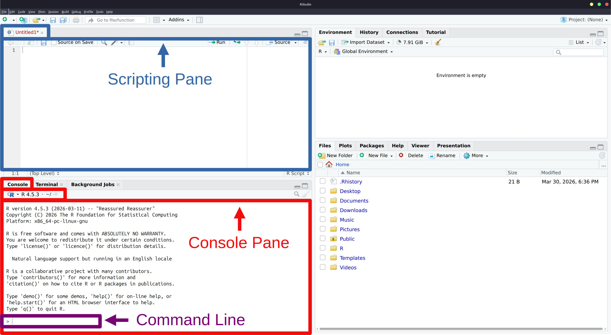
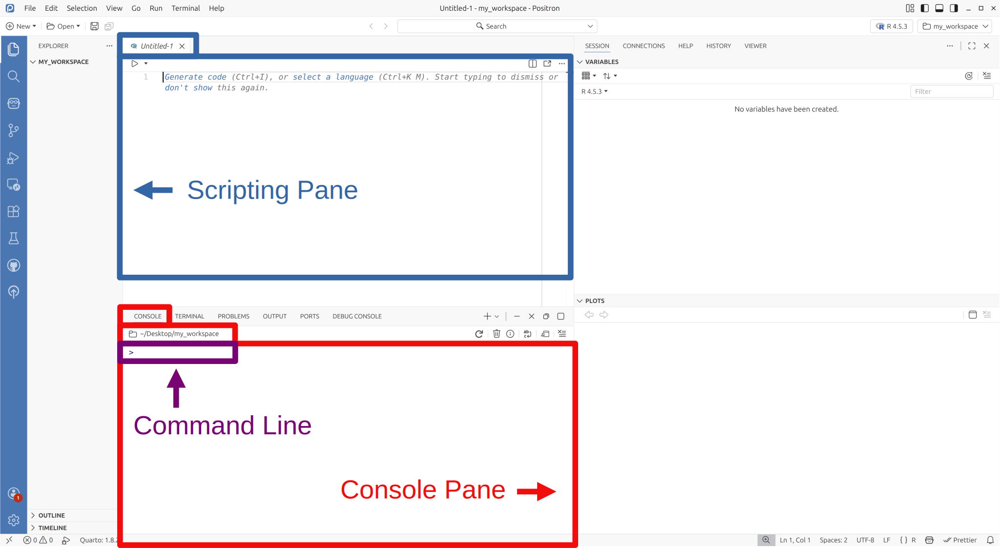

# R Basics

::: callout-caution
### Under Construction
:::

What follows assumes you have installed either RStudio or Positron, though almost everything discussed also applies to the base R environment that comes with the language on Windows and Macintosh computers.

## The Console Pane

When you launch the base-R environment (for Windows or Mac), launch RStudio, or launch Positron, somewhere on the screen will be a window pane labelled "*Console*". Assuming you have not tweaked the default layout, all three environments will have this located on the left side (see the sections highlighted in red in @fig-IDE_panes_html).

::: {.content-visible when-format="html" #fig-IDE_panes_html layout-nrow=2}

{#fig-rstudio_panes_html}

{#fig-positron_panes_html}

RStudio (a) and Positron (b) integrated development environments. Each pane serves a specific purpose for writing, running, and managing R code. Note that the scripting pane (top left) does not appear by default—open it by selecting File → New File.
:::

::: {.content-visible when-format="pdf" layout-ncol=2}

{#fig-rstudio_panes_html}

{#fig-positron_panes_pdf}

Test
:::

The console pane functions as a terminal for the R language specifically.[^console_py] Though, to distinguish it from your operating system's main terminal it is labelled "console." 

Within the console pane, you should see a $>$. This symbol denotes the *command line's prompt*.  In other words, it denotes the space in which you type commands, using R *code*, to your computer (this is the section highlighted in purple in @fig-IDE_panes_html). The term "code" here is just a shorthand way of referring to "computer code" which is a more modern way of expressing the fact that we are typing commands using a programming language. The presence of $>$ indicates that the computer is awaiting your command.

[^console_py]:This is technically a lie. RStudio and Positron give you the ability to toggle between both R and Python.

If you type `1 + 1` on the command line and then press "*enter/return*" on your keyboard, you should see a `2` display as an *output* almost instantaneously beneath it. In this case the expression `1 + 1` is a line of R code.  Pressing *enter/return*, runs (or executes) this R code. The `2` is the computer's resulting *output*."

Input:
```r
1 + 1
```

Output:
```{r}
#| echo: false
1 + 1
```

If you close RStudio or Positron, you will find that any history of this calculation is gone when you re-open the environment.  Consequently, typing commands into the console offers us a quick way to perform simple tasks that we are not necessarily concerned with preserving.  However, in most cases we will be typing R code that we do want to preserve, run, edit, and add to at later date.  This is where the concept of a *script* becomes important.

## The Scripting Pane

A script is a text document where you can type, run, edit, and save your R code. To create a new script in RStudio, select the *File* menu in the top left corner, hover over *New File*, and choose *R Script*. In Positron, the process is identical except you select *R File* instead.

Once opened, you can type R code into this new pane and save it in the conventional manner of most word processing applications (i.e., *File* $\rightarrow$ *Save As*). Additionally, this pane permits you to run lines of code selectively or all together. For instance, if you type the following into the script pane ...

```r
1 + 1
2 + 2
3 + 3
```

You can now place your cursor at a line of your choosing and run that line individually.  To do this in RStudio or Positron simply hold down the Control key on your keyboard and press *Enter/Return*. If you highlight all the lines of code, or just a subset of them, you can then run that highlighted section in a similar manner.

## Keyboard Shortcuts {#sec-key_shorts}
It is at this juncture that a noteworthy feature of programming environments be mentioned; specifically, keyboard shortcuts (also called "hotkeys"). All robust programming environments equip users with the ability to perform virtually any non-typing task directly from the keyboard, increasing efficiency and comfort. 

For instance, if you are using the Windows operating system, holding down the "*control*" key and pressing the "*s*" key will save your script file (Ctrl + S). Learning the shortcuts for frequently used features, such as selecting and running lines of code, will make the process of writing code considerably more time efficient and effortless.  In theory, a good programmer - using a competently developed coding environment - should never require the use of a mouse.  

RStudio and Positron both offer a wide range of keyboard shortcuts that can be customized to user preferences.  In RStudio, selecting *Help* $\rightarrow$ *Keyboard Shortcuts Help* will display a list of existing shortcuts that users can avail themselves of.  The same can be done in Positron by selecting *File* $\rightarrow$ *Preferences* $\rightarrow$ *Keyboard Shortcuts*. 

Please note, it is not being suggested that you go out of your way to memorize all of these at once. The simple act of trying to use them consistently will be sufficient to learn them in an effortless manner. At the outset, it is to your advantage to merely select a few and attempt to use them consistently while you code. A few of the most useful ones are listed in @tbl-key_shorts.  Many of these are not even exclusive to RStudio or Positron, but are just standard shortcuts in most operating systems.[^key_shorts]

| Description | Windows/Linux | Macintosh |
|-------------|---------|-----------|
| Run current line/section | Ctrl + Enter | Cmd + Return |
| Clear Console | Ctrl + L | Ctrl + L |
| Move to the beginning of a line | Home | Cmd + Left |
| Move to the end of a line | End | Cmd + Right |
| Move the cursor one word/block at a time | Ctrl + Left or Right | Option + Left or Right |
| Highlight all | Ctrl + A | Cmd + A |
| Highlight sections | Shift + Up, Down, Left, or Right | Shift + Up, Down, Left, or Right |
| Move cursor to script window | Ctrl + 1 | Ctrl + 1 |
| Move cursor to console window | Ctrl + 2 | Ctrl + 2 |
| Type the `<-` operator | Alt + - (minus) | Option + - (minus) |

: Useful Keyboard Shortcuts {#tbl-key_shorts}

[^key_shorts]:Shortcuts 3, 4, and 5 can be combined with shortcut 7 to highlight bigger sections of code.

::: callout-important
When utilizing the keyboard shortcuts mentioned in @sec-key_shorts, it is worth remembering that standard QWERTY-style keyboards are symmetrically designed. Modifier keys like the *shift* key, *control* key, and *alt* key are located on both the left and right side of the board.[^key_layout] This is not by accident and many people - even those who have grown up with unprecedented access to computers and the internet - have never learned to appreciate the utility of this layout or use it appropriately.

As an example, to type capital letters you should always depress the shift key on the opposite side of the keyboard to the letter. So, if you desired to type the capital letter *Q*, you would depress the right shift key with your right hand, and type *Q* with your left hand.  A similar logic applies to the other modifier keys. As another example, to use the keyboard shortcut in row 9 of @tbl-key_shorts, you would depress the right control key (with your right hand) and use your left hand to press the *2* key. You should not be trying to press both keys with a single hand.  Such advice might seem obvious but, given the sheer number of people who contort their wrists and fingers in grotesquely strange and painful ways, it is clearly far from being so.
:::

[^key_layout]:If this isn't true of your keyboard, it's time to get a better keyboard.

## How to Code Using R: Some Advice to Novice Programmers

With the formalities of installation, console, and scripting window behind us, we can now start learning to write (i.e., code) in R. But before we dive in, some advice for novice programmers is in order.

You don't need to memorize anything in this section or any section of this text. R is a language, and like any language, consistent use will lead to natural, effortless memorization over time. To help accelerate this process, here are some basic recommendations:

- Type all code yourself. Resist the urge to copy and paste. The physical act of typing reinforces learning.
- Run every example in the textbook and try to reproduce the same results.
- If you do not know how to do some particular thing, then look up how to do it each time you need to do it. Memorization will happen effortlessly over time.
- Stay organized. This applies to both the code you write and the files you save.
- Commit to using R for all your statistics from now on. Immersion is the fastest path to fluency.

Everything discussed here is designed to acquaint you with the R language so that when you encounter R code, you will not be overwhelmed or intimidated. As you progress through the book, you will learn more advanced concepts and see much of this material revisited and re-explained in new contexts. Your goal in this chapter is not to become an R expert, it is to develop an intuitive grasp of R's underlying syntax and logic.

## Basic Arithmetic

At its core R is really nothing more than a powerful calculator, and we can use it as such.  R can be used to add ($+$), subtract ($-$), multiply ($\times$), and divide ($\div$).

```{r results = "hold"}
666 + 13
13 - 666
9 * 27
666 / 9
```

Exponents can be incorporated as well by using the $^\wedge$ ("caret"), symbol. For instance, the expression $9^3$ can be written as ...

```{r}
9^3
```

R will also follow the ritualistic *order of operations* when dealing with more complex expressions.  To illustrate, consider the mathematical statement $8\div2(2+2)$. Some people mistakenly believe that this expression is equal to $1$, some believe it is equal to $4$, and others believe that it is improperly written and there is no solution. In fact, it is equal to $16$. As many will no doubt have learned in their primary education, according to order of operations (BEDMAS[^BEDMAS]), the order in which you divide and multiply inside the equation is not fixed, sometimes you divide first and sometimes you multiply first. However, what most people never learn is that the order you use is not up to you. You must always calculate from left to right when making a choice between multiplication and division.  The same rule applies to addition and subtraction.

[^BEDMAS]:"BEDMAS" of course being the famous mnemonic to help memorize the order of operations: Brackets, Exponents, Division, Multiplication, Addition, and Subtraction. Many non-Canadian readers may be more familiar with the inferior variants of this mnemonic, PEDMAS and PEMDAS.

```{r}
8/2*(2+2)
```

If we re-write the equation to be $8\div(2+2)2$, you will see a corresponding change in the computer's output.

```{r}
8/(2+2)*2
```

R also has the ability to perform *Euclidean Division,* which many may recall from their long suffering days in primary education days as simply "division with a remainder."  For instance, consider $11 \div 2$.  Conventionally, you would want and expect an answer of $5.5$, and R will produce that.

```{r}
11/2
```

However, if we want to see the result expressed as a quotient and remainder (i.e., if we want to use Euclidean Division), we could obtain the quotient by typing ...

```{r}
11 %/% 2
```

To obtain the remainder we type...
```{r}
11 %% 2
```

Thus, $11$ can be split into $2$ groups of $5$, with $1$ left over.  More technically, the `%%` is what is known as the *modulo operator* and the remainder value of `1` that results from `11 %% 2` is known as the *modulus*.

Other, more complex, arithmetic operations are available in the R language; however, most of them will require the use of specialized lines of code called *functions*, which are discussed later.

Given that we are on the topic of basic arithmetic, it is perhaps worth considering what happens when you "break the rules" of basic arithmetic. Suppose we divide a positive and negative value by zero, what will happen?

```{r}
1/0
-1/0
```

You can see that R produces a result of `Inf` and `-Inf` which is an abbreviated way of referring to infinity ($\infty$) in the positive and negative directions respectively.[^large_num]

[^large_num]:This will also be generated if a number is too large for a computer to cope with. For example, the code `.Machine$double.xmax` will produce the largest number your computer can handle. R will technically still let you add values to this number, but the number won't appear to change because the amount you would have to add to alter what is shown is excessively large. However, if you multiply it by $2$, you should get `Inf`.

What happens if you take the square root of a negative number?[^sqrt_neg]

[^sqrt_neg]:Recall that exponents can be used to take the square-root of a number.  For example, $\sqrt{4}$ can be expressed as $4^\frac{1}{2}$.

```{r}
(-4)^(1/2)
```

The abbreviation `NaN` here stands for `not a number,` and is a fairly sensible output given that the square root of a negative number does not exist as a real number (it only exists in your imagination).

Finally, since its use crops up from time to time, it can be handy to know that R comes with the number $\pi$ stored as a constant. To use it, you need only type `pi`.[^mmmm_pi]

[^mmmm_pi]:If you find $\pi$ displayed to seven digits inadequate, you may want to talk to a professionally licensed therapist. Alternatively, you can display more digits by running the code `print(pi, digits = 16)`. Values exceeding $16$ digits will be inaccurate given the limitations of 64-bit computers, so it is advisable not to go beyond $16$ even though a max of $22$ are possible. If you want R to always display all $16$ digits, you can change its default behaviour by running `options(digits = 16)`, though this is not recommended.

```{r}
pi
```

## Scientific Notation

On occasion values will be either excessively large or excessively small. In such cases R will often display the values using what is referred to as *scientific notation*.  For instance, dividing the number $2$ by $100000$ will result in scientific notation being employed:

```{r}
2 / 100000
```

Notice the `e-05` in the output. This is how you know R is presenting a number using scientific notation. To interpret this in a conventional manner, imagine there is a decimal point after the $2$, like so: `2.0e-05`. Then just move that decimal point five digits to the left. In other words, `2e-05` is the same as writing `0.00002`. Mathematically, `2e-05` translates to $2 \times 10^{-5}$.

If the output were showing `e+5`, then you would move the decimal five digits to the right. For example, `2e+5` is the same as writing `200000`. Notice there are five 0s; this is because, mathematically, `2e+5` means $2 \times 10^5$

Remember that positive powers move the decimal right (in the positive direction), and negative powers move the decimal left (in the negative direction).

## Commenting Out Lines

In the course of writing R code, there will be occasions where you would like to run a script you have typed up, but not necessarily run every single line on that script.  There might be certain lines that you would, at least tentatively, like to keep for one reason or another but not necessarily run.  You can accomplish this by "commenting out" your code.  If you type a `#` symbol, any code that follows that symbol and is on the same line as that symbol will not be run.

```{r results = "hold"}
1 + 5
# 2 + 4
3 + 3
1 + 2 + 3 # + 4 + 5
```

This process is phrased "commenting out" because using the `#` is also frequently employed to write short helpful comments to yourself and other readers about your R script.

## Creating Objects

A central feature of R is its ability to call objects in memory. For instance, we can define an object name, `x`, and have that name represent a number by typing a little arrow, `<-`, and following it with a value such as $1$.

```{r}
x <- 1
```

You will find that running this line of code produces no corresponding output.  However, if we now run `x` by itself the computer will display an output of $1$.

```{r}
x
```

If you look into how R actually stores what we have done in memory, the "object" in memory is the number $1$.  `x` is merely a name we are assigning to that object. However, a lot of R users are under the impression that the reverse is true - i.e., that we have in some sense created an object called `x` and stored something inside of it, but that is not actually the case. `x` is just a name binded to the object $1$, and this object $1$ is located somewhere inside your computer's memory. Admittedly, unless you are doing some seriously advanced R programming, this is a distinction that will not matter to most R users, but it is important because it means that if you do something like this . . . 

```{r}
x <- 1
y <- 1
```

`x` and `y` are technically different objects in the computer's memory.  However, if we did this ....

```{r}
y <- x
```

they now represent the same object in memory. Moreover, altering one does not affect the other and just ends up creating two separate objects in memory. E.g. ...

```{r results = "hold"}
x <- x + 1
x
y
```

To see a complete list of objects presently loaded in memory have a look at the *Environment* window pane in R studio and the *Variables* pane in Positron.

## Creating Objects (again)

To assign the names `x` and `y` we typed an arrow `<-`. However, we could have assigned the names using an equal sign `=` instead.

```{r}
y = x + 4
y
```

Both `<-` and `=`, in the manner we are using them here, are what are referred to as **assignment operators** in that, they are used to perform the *operation* of *assigning* a name to an object. For most use cases, there is no practical difference between the two; except insofar as the arrow can be swapped around to assign values to objects like so.

```{r}
10 -> z
z
```

The existence of both `=` and `<-` as assignment operators raises an obvious question: which is better to use?  This is a question for which there are strong opinions. While code written using `=` tends to have an intuitive appeal and requires one less key to press, the `<-` has greater functionality and is generally preferred by R's anointed high council (the overseers of Tidyverse) for that reason. If you opt to use `<-`, it is worth noting that RStudio and Positron contain a keyboard shortcut that offers a more ergonomic means of typing `<-` by pressing the alt key followed by a minus (-) sign.

::: {.callout-note collapse="true"}
## Comparing Assignment Operators: `<-` vs. `=`

⚡ **Advanced note:** New programmers can safely skip this section.

The original assignment operator of the S programming language was `<-`. The use of `=` to assign names to objects was a more recent development in S's history. This was doubtlessly motivated by 1) the intuitive appeal of `=` (you are setting something `equal` to something else), 2) its cleaner look, 3) its correspondence with other modern programming languages, and 4) the basic fact that it requires one less keystroke. It also has the added benefit of not resulting in confusion when dealing with inequalities. For instance, something like `x<-1` could be read as either assigning the name `x` to the object $1$, or it could be evaluating whether $x$ is *less* than $-1$.  As written here, the statement will result in the former unless appropriate spacing is applied; i.e., `x < -1`.  

Despite the obvious benefits of using `=`, much of R's core user-base favours `<-`. To understand why, it is helpful to know that, prior to its use as an assignment operator, the `=` was used to designate values to *arguments* inside a *function* and, to this day, it still serves this purpose. Consequently, when it was granted the coveted position of "assignment operator" it now had dual syntactic roles within the language but with a particular limitation: You cannot use `=` to both assign a value to a function's argument and create a variable simultaneously. With `<-`, you can.

**The Core Difference**

Consider calculating the mean of the numbers one through five. Using `=` to set the argument works but creates no new variable:

```{r}
#| echo: false
rm(x)  # Remove specific objects
```

```{r}
#| error: true
mean(x = 1:5)
x
```

Using `<-` both sets the argument and stores the values:

```{r}
mean(x <- 1:5)
x
```

**The Uber-Assignment operator: <<-**

The `<-` also has an advantage in that a simple variant of it, `<<-`, allows you to create variables within your own custom-made functions that are executable outside the scope of that function. Admittedly, this is a more advanced usage than readers of this text are likely to need, but it is an useful feature to know about as skills with R develop.

As a basic illustration, suppose we created a function, `rational_pi()`, that displays $\pi$ to the nearest integer, $3$, like so...

```{r}
rational_pi = function() {
  rat_pi <- 3
  return(rat_pi)
}
```
```{r}
#| error: true
rational_pi() # Returns 3
rat_pi # Error
```

At face value this is odd behaviour because, to be able to run the line `return(rat_pi)`, the object `rat_pi` must have been stored at some point.  And it was stored, but only *within the scope of the function*. To make `rat_pi` available outside the function's scope, we can employ `<<-` when we define the function:

```{r results = "hold"}
rational_pi = function() {
  rat_pi <<- 3
  return(rat_pi)
}

rational_pi()
rat_pi
```

Now we have a "rational" version of $\pi$ stored as `rat_pi`.  However, one other intriguing feature of `<<-` needs to be mentioned in this context: `<<-` only assigns a value within the function's scope, *if* the object you are creating does not already exist inside the function. However, the value will still get assigned globally (i.e., outside of the function's scope).  This is easiest to comprehend with a simple example:

```{r results = "hold"}
rational_pi <- function() {
  rat_pi <- 666   # Local assignment
  rat_pi <<- 3    # Global assignment only
  return(rat_pi)  # Returns the local value
}

rational_pi()  # Returns 666 (local value)
rat_pi         # Returns 3 (global value)
```

**Additional Advantages of `<-`**

The `<-` operator offers two other minor advantages: reversibility (you can write `->` and `->>`  to assign rightward) and consistency with R's documentation, where most code examples use`<-`. For many R users, this familiarity makes code easier to parse at a glance.
:::

## Object Modes {#sec-modes}

Thus far all of the objects we have created have been **numeric** objects; though, we can avail ourselves of other types.  For instance, another common object is the **character** object which gets defined using quotation marks on each end of the value.

```{r}
x <- "SPAM"
x
```

Both single or double quotation marks can be used to define a character object. For instance, running ...

```{r}
y <- 'SPAM'
y
```

works just fine, but if you were to mix and match the two types of quotation marks (e.g., try to run `y <- "SPAM'`), you will find that no actual output is produced, and the console just displays the code you tried to run with a small `+` appended to it. The `+` indicates that the line of code is incomplete and more is expected before an output can be returned. If this happens in RStudio, you need only press the escape key *esc* with your cursor inside the console window. In Positron press *Ctrl* + *c*.

A core point about character objects, which will probably seem obvious, is that you cannot perform standard mathematical operations on them.

```{r}
#| error: true
y * 5
```

Another type of object is what is known as a **logical** object.  This is an object that contains a value of `TRUE` or `FALSE` and is often referred to as a **boolean** object.

```{r}
x <- TRUE
y <- FALSE
x
y
```

The values `TRUE` and `FALSE` must be typed completely in uppercase without quotations for R to recognize them as a logical object.  Alternatively, R does permit a shorthand version of each.  Instead of typing `TRUE` and `FALSE`, you can type `T` and `F` respectively.  Though, for ease of reading, using this shorthand version is not advised.

Thus far, we have demonstrated three basic categories of object: *numeric*, *character*, and *logical*.  R refers to these various categories as **modes**,[^modes] and as you progress with R, both in this book and more generally, you will encounter other object modes.

[^modes]:You may sometimes hear these referred to as object "classes" as well. The distinction between modes and classes in R is nuanced, with considerable overlap between the two terms; though, they are not perfectly equivalent. I have chosen to refer to object modes because it more consistently categorizes objects as numeric, character, or logical, which I believe is helpful for beginners learning R.

## Naming Objects {#sec-naming_objects}

Often we will run into circumstances where other people are required to read, run, and modify the code we write.  Still other times, we may need to look at, and make sense of, code we have written in the past and largely forgotten. These considerations make it of the utmost importance that all of the code we write is intelligible to other people and our future selves. Among the best way to achieve this is by naming objects appropriately. Ideally, the name of an object should be concise and descriptive. Generally, you can name objects almost anything you like, as long as the name begins with a letter, contains no spaces, avoids special characters (except underscores `_`), and does not use any of R's **reserved words** such as `TRUE`, `Inf`, `NaN`, `function`, etc.

Given that spaces are not permitted in the naming of objects, programmers have developed certain conventions to promote readability. One such convention is *snake case*, which separates lowercase lettered words with an underscore: `snake_case <- 1`.

Another, referred to as *camel case*, denotes separate words by capitalizing the first letter of each new word: `camelCase <- 2`

There is also *period case*: `period.case <- 3`.

There is *random case* [@Wickham2023]: `Ra.nD0M_CAs.e <- 4`

Finally, there is of course *angry case* for those moments when you need to communicate your frustration with coding: `ANGRYCASE <- 5`

Apart from the last two, R programmers tend to use all of these with seeming abandon. It is worth noting that different style guides for R have been developed and altered over the years with varying degrees of adoption. Presently there is no consensus on which style-guide should act in an official capacity for R; however, the most popular, and widely respected, is the *Tidyverse* Style Guide[^tidyverse_explain] (<a href = "https://style.tidyverse.org" target = "_blank">https://style.tidyverse.org</a>) which advocates the strict and concise use of *snake_case* only.

[^tidyverse_explain]:The *tidyverse* will be explained in the next chapter, just know that all the code written in this book will (do its best) to adhere to its standards.

When it comes to naming objects, all of the rules just laid out only apply to what are referred to as **syntactic names**; however, if villainy is more your style, you can gleefully ignore all of those rules and conjure up what are called **non-syntactic names** by simply enclosing the name within backticks.

```{r}
`420 * 69` <- "PARTY TIME!"
`The devil made me do it!` <- "Hail Satan"
```

## Vectors {#sec-vectors}

It is not the case that an object need store only a single value, as we have been doing above. Particularly when conducting statistical analyses, you are almost always working with variables that contain more than one value (i.e. multiple observations). In view of this, R objects can store as many values as you require. For instance, if we want `x` to be equal to the numbers 1 through 5, we need only type: 

```{r}
x <- c(1, 2, 3, 4, 5)
x
```

The lower case `c` is short for *combine*. By combining the numbers $1$ through $5$ in this way we have created what is technically known as a **vector**.[^vector] We can further use this combine function, `c()`, to combine vectors with other vectors. In the example below, we create two vectors, `x` and `y`, and combine them to create an object called `z`.

[^vector]:More specifically, we are speaking of *atomic vectors* here, though most people just call them *vectors.*

```{r}
x <- c(1, 2, 3, 4, 5)
y <- c(6, 7, 8, 9, 10)
z <- c(x, y)
z
```

::: callout-tip
## How to Use Your Colon Effectively
In the previous examples, we used R's combine function to create a basic set of ascending numbers. The need to generate regular sequences of integers is a common occurrence in data analyses, so R provides users with a convenient means to create them using the **colon operator** (`:`).

```{r}
x <- 1:5
x
```

This can also be used in reverse and with negative values.

```{r}
3:-5
```
::: 

The concept of a vector is one which will have relevance to people with a fondness of linear and matrix algebra,[^matrix_algebra] since it amounts to little more than a one-dimensional array/matrix. We can see how R handles vectors for these purposes by simply performing some mathematical operations on them. For instance, if we add a single number to our vector, we can see that R straightforwardly adds that number to each element (i.e. position) in the vector.

[^matrix_algebra]:While I assume such people must exist, their existence is about as well-confirmed as that of the Sasquatch.

```{r results = "hold"}
x
x + 2
```

Correspondingly:

```{r results = "hold"}
x - 2
x * 2
x / 2
x^2
```

A similarly logical process is seen when we perform mathematical operations on two or more vectors of the same size.  For instance, adding them together results in the first element of one being added to the first element of the other.  The second element of one being added to the second element of the other, and so on.

```{r}
x <- c(1,2,3,4,5)
y <- c(6,7,8,9,10)

x + y
```

However, a curious thing will occur if the vectors have an unequal number of elements greater than 1. Suppose, as an example, one vector has four elements and another has five and we want to add them together. In the process of adding the first element with the first element, and the second element with the second, and so on, R will automatically loop back around to the first element in the shorter vector to complete the calculation; though, it does this only after giving you a warning.  Needless to say, you should not be performing any arithmetic on vectors of unequal lengths.

```{r}
#| error: true
x <- c(1,2,3,4)
y <- c(6,7,8,9,10)
x + y
```

Vectors are also not limited to numbers. They can also contain character values and logical values.

```{r results = "hold"}
a <- c(1,2,3)
b <- c("BREAD", "SPAM", "BREAD")
c <- c(TRUE, FALSE, FALSE)

a
b
c
```

Though, you cannot mix and match. For instance, if you have a character string amongst a set of numeric values, those numeric values will all be converted to character strings as evidenced by the quotation marks in the output below.[^mode]

[^mode]:You can also check the vector's mode by running `mode(d)`.

```{r}
d <- c(5, "SPAM", 6, 7, 8)
d
```

If you have logical values amongst a set of numeric values, those logical values will be transformed such that `TRUE = 1` and `FALSE = 0`, making the entire vector numeric.

```{r}
e <- c(666, TRUE, FALSE)
e
```

In fact if you have an entire vector of logical values you can treat the `TRUE` and `FALSE` values as 1s and 0s respectively. This is a feature of logical vectors that frequently comes in handy.

```{r}
x <- c(100)
g <- c(TRUE, TRUE, FALSE, FALSE, TRUE)
x + g
```

Similar to how R comes with $\pi$ stored as a constant, it also has constants for a few commonly used character vectors. For more info about these 

```{r}
LETTERS
letters
month.name
month.abb
```

Notice in the previous example's output that the numbers within brackets indicate the position number of a element in the vector.  For example, in the vector `LETTERS`, `"T"` is located at the 20^th^ position.  In the vector `month.name`,  `"July"` is in the 7^th^ position. Every new line written to the console screen gives the position number of the first element on the line - meaning that the size of your console screen will effect which position numbers get displayed (so you might have different values that what is shown above).

It is not by accident that these positions are demarcated using square brackets. Square brackets serve a special purpose in R.  They allow us to subset values by referencing their position in the vector. For instance, if we want to know what the 17^th^ letter of the English alphabet is, we need only type ...

```{r}
LETTERS[17]
```

If we want to list out the first 5 letters we can simply insert a numeric vector...

```{r results = "hold"}
LETTERS[c(1, 2, 3, 4, 5)]
# or equivalently
LETTERS[1:5]
```

By contrast, if we want to list out all of the letters, except the first five (i.e., exclude the first five), we can include a minus sign in front of the combine symbol.

```{r results = "hold"}
LETTERS[-c(1, 2, 3, 4, 5)]
# or equivalently
LETTERS[-1:-5]
```

The use of vectors inside the indexing brackets allows us to select any position we want.  For instance, if we wanted to examine the 2^nd^, 3^rd^, 5^th^, 7^th^, 11^th^, 13^th^, 17^th^, 19^th^, and 23^rd^ numbers (all prime numbers), we can create a vector of those values and simply insert it into the index. 

```{r}
primes <- c(2, 3, 5, 7, 11, 13, 17, 19, 23)
LETTERS[primes]
```

Somewhat uniquely, within the R programming language every *single* basic data object—such as a number, character string, or logical value—is inherently a vector. For example, the number `666` is a vector, the character string `"SPAM"` is a vector, and the logical value `FALSE` is also a vector. These are simply vectors with a single element, or a length of 1. As such, all of these can be indexed just like any other vector with a length greater than 1.

```{r results = "hold"}
666[1]
666[2]
"SPAM"[1]
FALSE[1]
```

Notice in the second line, when `666` was indexed at position 2, R returned `NA` because no value exists at that position. The moral of the story is that, when the combine function,`c()`, is used, you are not creating a vector, but rather combining vectors.

## Operators And Comparison Statements

Symbols in R such as `<-`, `+`, `-`, and so on are referred to as operators because they are used to perform "operations" such as assigning a name to an object, adding numbers together, etc.  Table @tbl-operators shows a list of some common operators in R that we have seen before and some new ones called **relational operator**.  These are operators that evaluate a comparison of some kind.  For instance, you can evaluate whether one value is *greater than* or *less than* another value.

```{r results = "hold"}
3 > pi
3 < pi
```

In the above example, the statement "three is *greater* than $\pi$", is a *false* statement. By contrast, the statement "three is *less* than $\pi$", is a *true* statement.

| Type | Operator | Description |
|:------------:|:-----------------:|:-----------------------------------------|
| Assignment | `x <- value` | Assign a value to a name. |
| | `value -> x` | Assign a value to a name (rightward). |
| | `x = value` | Assign a value to a name. |
| Arithmetic | `x + y` | Addition |
| | `x - y` | Subtraction |
| | `x * y` | Multiplication |
| | `x / y` | Division |
| | `x^y` | Exponentiation |
| | `x %% y` | Modulo (remainder after division) |
| | `x %/% y` | Integer division (quotient without remainder) |
| Relational | `x < y` | Less than |
| | `x > y` | Greater than |
| | `x <= y` | Less than or equal to |
| | `x >= y` | Greater than or equal to |
| | `x == y` | Equal to |
| | `x != y` | Not equal to |

: Basic R Operators {#tbl-operators}

In a similar fashion, you can also evaluate whether a value is *greater than or equal to* some other value or *less than OR equal to* some value. For example:

```{r results = "hold"}
pi >= pi
pi <= pi
```

You can also evaluate whether two values are *equivalent* or *not equivalent*, by using the symbols `==` and `!=` respectively.

```{r results = "hold"}
pi == pi # testing if equivalent
pi == (22/7)
pi != (22/7) # testing if NOT (!) equivalent
```

## Functions
In conventional mathematics a function is a way of relating an input to an output [@Pierce2022].  Typically this is notated as

$$
f(\text{input}) = \text{output}
$$ {#eq-}

When you place something inside the left parentheses, there is a corresponding output. The use of $f$ here to denote the function is just a formality mathematicians have adopted.  A function can be named or symbolized with anything.  

As an example of a function's use, we could create one that outputs the square root of a number.

$$
f(x) = \sqrt{x}
$$ {#eq-}

In this case, $x$ is just acting as a place holder; thus, swapping the $x$ inside of $f()$ with a real number will give us a corresponding output by taking the square root of that number. For example, if we insert the number 25 into the function:

::: {.content-visible when-format="html"}
$$
\begin{align}
f(25) &= \sqrt{25} \\
      &= 5
\end{align}
$${#eq-}
:::

**Functions** in R work identically to this.  For instance, R has a function for finding the square root of a number, except instead of naming the function $f(x)$, it names the function `sqrt(x)`.

```{r}
sqrt(25)
```

And, rather conveniently, R will also store the output of a function as an object if you ask it to.

```{r}
x <- sqrt(25)
x
```

As you might expect, given its lineage as a tool for data analysis, R has many such functions. Examples of some of the more common, self-explanatory ones can be seen below. For each we will insert a vector containing the values one through five.[^combine_func]

[^combine_func]:It's perhaps worth pointing out that the small `c` we use to combine values into a vector is also a function, which is why it is always followed with parentheses,`c()`.

```{r results = "hold"}
x <- c(1, 2, 3, 4, 5)
```
```{r}
# Calculating the sum of all the values:
sum(x)
```
```{r}
#Calculating the product of all the values:
prod(x)
```
```{r results = "hold"}
# Calculating the minimum and maximum of all the values:
min(x)
max(x)
```

```{r}
# Calculating the length (i.e., number of elements) of a vector:
length(x)
```

```{r}
# Calculating the mean of all the values:
mean(x)
```

```{r}
# Calculating the median of all the values:
median(x)
```

Functions are not limited to just mathematical processes either.  For instance, R has a function to tell us what an object's mode is, thus allowing us to determine if the vector consists of numeric, character, or logical values.[^mode_fun]

```{r}
mode(x)
```

[^mode_fun]:Do not confuse this with the mathematical concept of a modal value; i.e., the number that appears most often.

## Arguments

The utility of functions in R actually extends far beyond this basic usage because most functions are easily modified through the use of *arguments*. An "argument" is simply a parameter that allows you to customize how a function operates. A simple example of this is the `round()` function.  This is used to round numbers to a specified decimal place. For instance, if we have a vector that contains both the number $\pi$ and the $\sqrt{2}$

```{r}
x <- c(pi, sqrt(2))
x
```

We can use the `round()` function and its `digits` argument to round these to 2 digits.

```{r}
round(x, digits = 2)
```

Alternatively, we could round to the nearest integer:

```{r}
round(x, digits = 0)
```

Critically, in the above two examples, we have specified the `digits` argument using an `=` sign. Generally speaking, this is the best practice and original purpose of `=` because, while you are permitted to use the assignment operator `<-` in place of this, doing so will store an object called `digits` unnecessarily, wasting your computers resources and cluttering R's working environment. 

The `round()` function only takes one argument but many functions take multiple arguments.  A good example of this is the sequence function, `seq()`, which generates regular number sequences.  For instance, if you wanted to generate a sequence from 0 to 100, counting by 2's, there are three arguments you will need to set: `from`, `to`, and `by`:

```{r}
seq(from = 0, to = 100, by = 2)
```

The sequence function is also illustrative of another feature of functions, often they will have mutually exclusive arguments. Instead of using the `by` argument, we could have used the `length.out` argument to specify how many values we want in our sequence.

```{r}
seq(from = 0, to = 100, length.out = 6)
```

To save yourself some effort in typing out functions and their corresponding arguments, you can actually just provide the values, without the argument name and equal sign, provided you specify the arguments in the correct order.

```{r}
seq(0, 100, 2)
```

To determine the correct ordering of arguments you will need to consult the function's **R documentation**.

## R (Help) Documentation

R includes a vast array of built-in functions, some of which perform highly complex tasks. Consequently, when reading R code, you will often encounter functions whose purpose and usage seem mysterious. To demystify these functions, it is often necessary to consult R's help documentation. Each function in R comes with corresponding documentation that outlines its purpose, explains its arguments, and provides references. While R's documentation can often be challenging to interpret for novice users, it should always be your first resource when you are unsure about how a function works or what it does. Only after consulting the help documentation should you turn to additional resources, such as internet searches or forums.

To access the documentation for any function in R, simply precede the function name with a question mark and run it in the R console. For example, running `?mean` will bring up the documentation for the arithmetic mean function.

::: {.callout-note collapse="true"}
## R Documentation for `mean()`
```{r}
?mean
```

mean {base}

<h2>Arithmetic Mean</h2>

<h3>Description:</h3>

Generic function for the (trimmed) arithmetic mean.

<h3>Usage:</h3>

```r
mean(x, ...)
     
## Default S3 method:
mean(x, trim = 0, na.rm = FALSE, ...)
```
     
<h3>Arguments:</h3>

`x:` an R object.  Currently there are methods for numeric/logical vectors and date, date-time and time interval objects. Complex vectors are allowed for ‘trim = 0’, only.

`trim:` the fraction (0 to 0.5) of observations to be trimmed from each end of ‘x’ before the mean is computed.  Values of trim outside that range are taken as the nearest endpoint.

`na.rm:` a logical evaluating to ‘TRUE’ or ‘FALSE’ indicating whether ‘NA’ values should be stripped before the computation proceeds.

`...` further arguments passed to or from other methods.

<h3>Value:</h3>

If `trim` is zero (the default), the arithmetic mean of the values in `x` is computed, as a numeric or complex vector of length one. If ‘x’ is not logical (coerced to numeric), numeric (including integer) or complex, `NA_real_` is returned, with a warning.

If `trim` is non-zero, a symmetrically trimmed mean is computed with a fraction of `trim` observations deleted from each end before the mean is computed.

<h3>References:</h3>

Becker, R. A., Chambers, J. M. and Wilks, A. R. (1988) _The New S Language_.  Wadsworth & Brooks/Cole.

<h3>See Also:</h3>

`weighted.mean`, `mean.POSIXct`, `colMeans` for row and column means.

<h3>Examples:</h3>

```{r}
x <- c(0:10, 50)
xm <- mean(x)
c(xm, mean(x, trim = 0.10))
```

:::

All R documentation follows a consistent structure, designed to provide users with a comprehensive understanding of each function. At the top, you will find the name of the function along with the name of the package it belongs to, enclosed in braces. For example, consulting the documentation for the `mean()` function displays `mean {base}` at the top, indicating that this function is part of base R. Similarly, for other common functions like `sd()`, you might see `{stats}' listed. The stats package, included with R, contains functions for statistical calculations and random number generation, provided by the R Core Team alongside base R functions.

Beneath the function name and package, you will find a brief Description section outlining the function's purpose. This is typically followed by a Usage section, which includes a code block demonstrating how the function is used and detailing its arguments. For instance, documentation for the `mean()` function includes the following usage:

```r
mean(x, ...)

## Default S3 method:
mean(x, trim = 0, na.rm = FALSE, ...)
```

The topmost line of the code block, `mean(x, ...)`, represents the minimal working example for the function. This indicates that, at a minimum, the argument `x` must be provided for the function to work. The Arguments section below the code block provides further details about `x`. Specifically, it states that `x` is an "*an R object.  Currently there are methods for numeric/logical vectors and date, date-time and time interval objects. ...*" In simpler terms, this is saying that `x` should be a numeric or logical object and not, for instance, a character object. For example:

```{r}
nums <- 0:666
mean(x = nums)
```

In this case, `nums`, a numeric vector, is the R object provided to the argument `x`.

Beneath the minimal working example, in the Usage block, is a line of code displaying the various additional arguments the function has: `trim` and `na.rm`. These arguments are optional because they come with default values, meaning they do not need to be explicitly set by the user, unlike the required argument `x`.

Further down, the documentation includes a Value section, which describes the output of the function based on the arguments provided and the data types used. Finally, the documentation concludes with additional details references, supplemental links, and practical examples to demonstrate the function's usage in real-world scenarios.

## Missing Values

A common hurdle in data analysis are missing values.  Values can be missing for any number of reasons; perhaps a participant never showed up for a research session, perhaps an lab animal died, perhaps there was a equipment malfunction, perhaps someone recorded something incorrectly, or maybe you just ran out of time and money. The R language denotes missing values using `NA`, which stands for "not available." In many instances, numerical calculations on a `NA` value will simply result in another `NA` value.

```{r}
5 + NA
```

Intuitively, this behaviour makes a fair amount of sense to most people.  We do not know what `NA` is or should be, so the expression `5 + NA` cannot be evaluated. And R, quite logically, extends this principle to functions:

```{r}
x <- c(710, 633, 786, NA, 642)
mean(x)
```

However, in this latter case, the logic which seemed so obvious initially seems less so now.  Consider that these values might be observations from an experiment.  Many researchers will reflexively ignore the `NA` and compute the *mean* of these values as readily as a rat devours a food pellet, and it is to R's credit that it actually prohibits its users from indulging so recklessly.

How missing values should be handled is a matter of great importance and statisticians often disagree on what the best practice should be in any given case. In a situation like this, most people would simply ignore the missing element and treat the vector as containing only four values. However, most data sets are not this simplistic.  That `NA` might be *paired* with collected observations of other variables. That is a situation where you might, for the purpose of conducting a certain analysis, require a number to be in that fourth spot. What do you do then? Do you replace `NA` with the mean of the four values, do you replace it with the median, or do you do something else?

There is no one-size-fits-all answer here; however, in those instances where simply ignoring the `NA` is the sensible course of action, many base R functions allow you to specify an additional logical *argument*, `na.rm`, that will remove any `NA` values prior to calculation. You can see this by simply accessing the R documentation (e.g., `?mean`). By default the argument is set to `FALSE` and setting `na.rm = TRUE` will remove the `NA` values accordingly.

```{r}
mean(x, na.rm = TRUE)
```

For situations where a function does not have a `na.rm` argument or equivalent, the function `is.na()` can be easily employed. This function evaluates whether each element of an R object is missing or not and returns a logical (`TRUE` or `FALSE`) value. For example:

```{r}
x <- c(710, 633, 786, NA, 642)
is.na(x)
```

Looking at the output, we can see that the fourth value is missing because it has returned a value of `TRUE` (i.e., the function has determined that it *is* a `NA` value).  Combing the behaviour of this function with the indexing feature of vectors (see @sec-vectors) and a **logical operator** called the **negation operator** (denoted using `!`), we can easily obtain a version of the vector with missing values excluded.

```{r}
x[!is.na(x)]
```

With the negation operator, the expression `!is.na(x)` can be interpreted as asking, "which values of `x` are *not* missing values?  This is easily seen by comparing the *is.na()* function with and without the negation.

```{r results = "hold"}
is.na(x)
!is.na(x)
```

Notice that the `!` just provides the logical opposite (i.e., negation) of the original function.  Thus, putting all this together, you could write ...

```{r}
mean(x[!is.na(x)])
```

...in lieu of using or not having a `na.rm` style argument to remove missing values.  To novice users of R, techniques like this may seem cumbersome initially.  This is especially the case when you are dealing with so few values and can immediately see what is and is not missing within the data. For instance, noting that the fourth value is missing from `x`, you could simply create a new vector of the form `y <- c(710, 633, 786, 642)` and insert that into your functions. However, many (if not most) data sets are too large to "eyeball" and manually rebuild in this way. Automated solutions like those shown with the negation operator are not only necessary to save time, but are also less prone to error.

## Data Frames

While there are situations where a single vector constitutes the only data that needs to be analyzed, it is more often the case that you are working with "sets" of data.  That is to say, typically your data consists of observations across a range of different variables.  Consequently, for the purposes of organization, it is helpful to keep all of this data stored as a single object.  In R, there are a number of ways you could do this.  You could store data as a *table*, a *list*, or a *matrix* which are all unique *classes* of objects R recognizes. However, for most uses cases, a **data frame** is going to be the preferred method of data storage in R.

In its simplest terms a data frame is simply a spreadsheet, where rows represent observations and columns represent variables. Consider a hypothetical experiment with two groups, a control and experimental group, and 10 observations, one of which is missing for some reason. Visually, the data might look like @tbl-ex_df

| subject | group | value |
|---------|-------|-------|
| 1       | Exp   | -0.36 |
| 2       | Cont  | 0.28  |
| 3       | Exp   | 1.54  |
| 4       | Cont  | 0.51  |
| 5       | Exp   | -1.28 |
| 6       | Exp   | 1.15  |
| 7       | Cont  | -2.22 |
| 8       | Exp   | -0.51 |
| 9       | Cont  | NA    |
| 10      | Cont  | -1.04 |

: Useful Keyboard Shortcuts {#tbl-ex_df}

We can easily recreate this in R using the `data.frame()` function. Inside the function, we specify our desired columns as *arguments*.

```{r}
df <- data.frame(
  subject = 1:10,
  group = c("Exp", "Cont", "Exp", "Cont", "Exp", "Exp", "Cont", "Exp", 
            "Cont", "Cont"),
  value = c(-0.36,  0.28,  1.54,  0.51, -1.28,  1.15, -2.22, -0.51,  
            NA, -1.04)
)
df
```

Alternatively, if you have the variables *subject*, *group*, and *value* already stored as individual vectors, you could build your data frame in the following way:

```r
df <- data.frame(subject, group, value)
df
```

Now, strictly speaking, you would almost never input your data into R in the manner we have done here (i.e., by manually typing in the values). However, the basics of constructing a data frame is an essential, and frequently appealed to, piece of knowledge when working with R.

### Critical Features of Data Frames

There are two critical features of data frames that separates them from traditional spreadsheets.  The first is that each column needs to consist of a single object mode (e.g., *numeric*, *character*, or *logical*; see @sec-modes). For instance, in the data frame above, the `subject` column consists only of *numeric* objects, the `group` column only consists of *character* objects and the `value` column, again, only consists of *numeric* objects. We can see this by running the following code:

```{r}
sapply(df, FUN = mode) 
```

In this example, the `sapply()` function has, quite literally, *applied* the function `mode()` to each of the columns of our data frame, thereby telling us what each column's mode is. The argument `FUN` is just short for "function" and is telling `sapply()` what function you want to *apply* to the columns. In this case we are applying the `mode()` function. 

Knowing the mode of a column is very important because columns behave like vectors insofar as trying to mix and match different object types within a single column will potentially change that entire column.  As an example, if we had coded ... 

```{r}
value = c("-0.36", 0.28, 1.54, 0.51, -1.28, 1.15, -2.22, -0.51, NA, -1.04)
value
```

you will find that every single number in that column automatically becomes a character object even though only the first of the nine elements was typed as a character object. This is going to be very irritating if you want to perform mathematical operations on that column and are unaware that all of its elements have been coerced into character objects (notice that printing the data frame does not show character objects with quotes like vectors do).

The second critical feature of data frames is that each column *must* contain the same number of elements as every other column.  In our example, *subject*, *group*, and *value* all contain 10 elements (the missing value is counted as an element).  In most cases, if you try and build a data frame with columns of unequal lengths, R will produce an error message. 

```{r}
#| error: true
df_2 <- data.frame(
  a = 1:4,
  b = 1:3
)
```

In other cases, if you have an unequal amount of values in your columns and R determines that it can evenly repeat a sequence, R will automatically recycle that sequence.

```{r}
#| error: true
df_3 <- data.frame(
  a = 1:4,
  b = 1:2
)

df_3
```

Notice in the above example that we assigned four values to the `a` column and two values to the `b` column and instead of producing an error, R simply recycled the values in `b` to fill the empty spots.

### Indexing Data Frames

Similar to how vectors can be indexed using square brackets, data frames can also be indexed.  Going back to our original data frame (`df`), suppose we wanted to look at the value found in the fifth row of the third column. This can be easily accomplished in the following way:

```{r}
df[5, 3]
```

Notice, the number on the left side of the comma (`5`) refers to the row, and the number on the right side (`3`) refers to the column. The easy way to remember this is that the numbers in the brackets represent a $x$ and $y$ coordinate system, with $x$'s being rows, and $y$'s being columns. 

In the last example we selected a single element of our data frame, but we can select more than one value and more than one column if need be.  For instance, we could isolate rows $1$, $3$, and $5$, from columns $2$, and $3$ only.

```{r}
df[c(1, 3, 5), c(2:3)]
```

If you wanted to keep all the columns visible while only looking at rows $1$, $3$ and $5$, you need only to leave the left side of the comma blank.

```{r}
df[c(1, 3, 5), ]
```

A similar logic applies to rows:

```{r}
df[ , c(2:3)]
```

### Extracting Columns as Vectors

There will also be many circumstances where you need to work with the values of a single column only.  For instance, if you want to calculate the mean of the third column `value`, you can use one of R's extraction operators, the `$`, to isolate that column. The following code will isolate the `value` column and output it as a vector:

```{r}
df$Value
```

You can, therefore, just insert this into the `mean()` function.

```{r}
mean(df$Value, na.rm = TRUE)
```

Alternatively, instead of using the `$` operator, you can use doubled square brackets to specify the column number you want:

```{r}
df[[3]]
```

Neither method of extracting a column is intrinsically better than the other.  It really boils down to whether you prefer to reference your columns by names or numbers. The former is often easier to read at the expense of writing more code, whereas the latter, while harder to discern at a quick glance, requires less writing and can produce, superficially, a tidier looking script.

If you want to extract a column, but still preserve its classification as a data frame instead of *dropping* it to a vector you can include the argument `drop = FALSE` inside your indexing brackets. This is useful for situations where you want to preserve the name of the column you have indexed.

```{r}
df[ , 3, drop = FALSE]
```

### Adding and Removing Columns

Adding new columns to a data frame is very simple. Suppose we wanted to create a column named `alpha` containing the first 10 letters of the English alphabet.

```{r}
df$alpha <- letters[1:10]
df
```

If we wanted to create a column named `new_val` that multiplies all the numbers in the `value` column by $100$, we can easily do that.

```{r}
df$new_val <- df$value * 100
df
```

To remove a column, there are a few common options. Assuming you want to remove the `alpha` (fourth) column, you can just set that column equal to a **null value**, which just means that something is undefined and therefore does not exist as an object in the R language.

```{r}
df$alpha <- NULL
df
```

If you want to remove multiple columns, a quick way is to simply index the columns you do NOT want to keep, negate them using a minus sign (which means you are now technically indexing the ones you DO want to keep). You can then override your data frame object, which in our case is `df`. To illustrate, we will remove column's one and four.

```{r}
df <- df[ , -c(1, 4)]
df
```

### Adding and Removing Rows

To add a row to an existing data frame, the conventional strategy is to use the `rbind()` function. "rbind" is short for "row bind" and does more or less what it says on the box: it binds (i.e., combines) objects by rows. For instance, if we create a new dataframe that contains a row (or rows) we want to add, we can then use the `rbind()` function to append it to the original dataframe.

```{r}
new_row <- data.frame(
  group = "SPAM",
  value = 999
)
                      
df <- rbind(df, new_row)
df
```

To remove rows (e.g., 9 and 11), you can follow the same basic process that was outlined for removing columns.

```{r}
df <- df[-c(9, 11), ]
df
```

### Row and Column Names

Notice in the previous example that, by removing row $9$ (i.e., the row that contained the `NA` value), the index numbers on the leftmost side of the data frame's output become mislabelled. It counts from $1$ to $8$, skips $9$, and goes straight to $10$. The reason it does this is because those numbers on the left are not actually index values, as you might reasonably assume. They are actually *row names* and, when the data frame was initially created, the rows were literally named $1$ through $10$.  

R users tend to be on the fence as to whether this is a useful feature or not. It does provide a nice visual confirmation that specific rows have been removed, but also makes future indexing potentially more confusing since the row named $10$ is actually the $9$^th^ row.  Thus, its often helpful to rename the rows after you have subset or removed certain values. You can do this using the `rownames()` function.

[^rownames]:If you, like the *tidyverse* high council, see this as a mild heresy, fear not—the *tibble* (covered in the next chapter) was made with you in mind.

```{r}
rownames(df) <- 1:nrow(df)
df
```

Note that we used the function `nrow()` to create the sequence of numbers. This function simply counts how many rows are in a data frame.

```{r}
nrow(df)
```

An alternative way of defining the row names would have been to type `rownames(df) <- 1:9`; however, this is STRONGLY discouraged.  The reasons being that, if you are working with a large data frame, you often do not know how many rows there are. Additionally, if some aspect about your data frame changes in the future (maybe because you have updated your data set or indexed different values), the `1:9` is no longer going to be accurate and will produce errors that you may or may not notice, unless you have remembered to change it. Using the code `1:nrow(df)` ensures that your row names will always be correct.

Here we have named our rows using numbers, but you can technically name rows anything you want.

```{r}
rownames(df) <- month.name[1:nrow(df)]
df
```

Generally speaking though, this is not something you should be doing.  If you wanted to label each row with a name of the month, you would be better off creating a new column called `month`, and keeping the row names as ascending integers.

Column names can be renamed in a similar fashion using the `colnames()` function. Though, R's syntax does not permit you to name them solely with numeric values, nor are you allowed to include spaces or any type of special characters other than an underscore.

```{r}
colnames(df) <- c("1st_Col", "2nd_Col")
df
```

If you do use a number, space, or special character to name your column, it becomes a **non-syntactic** name (see section @sec-naming_objects) and backticks become necessary to isolate it. 

```{r}
colnames(df) <- c(1, "Col 2")
df
```

```{r}
#| error: true
df$1
```

```{r}
#| error: true
df$Col 2
```

```{r}
df$`1`

df$`Col 2`
```