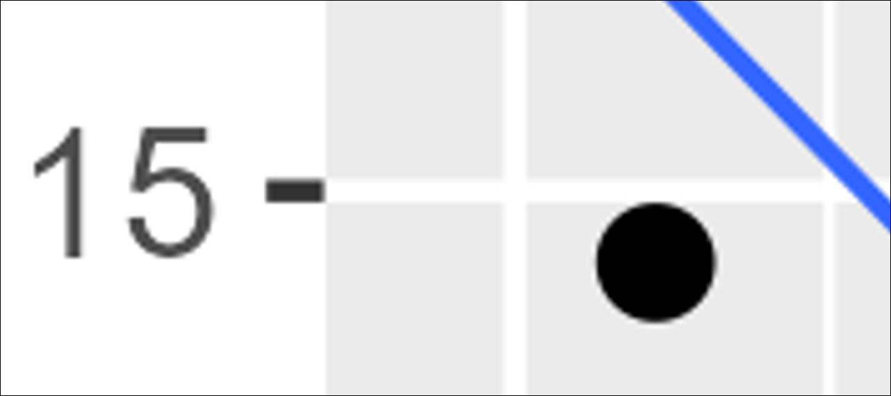
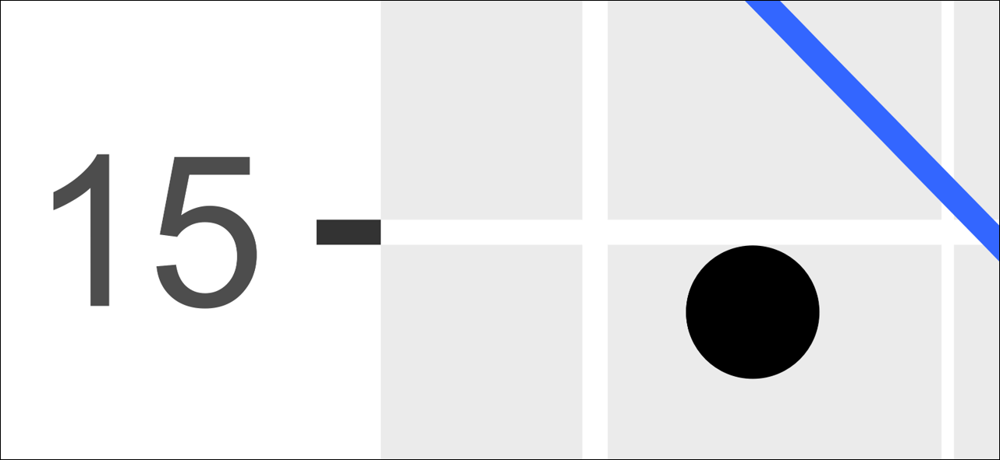
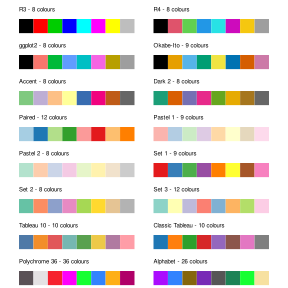

---
knitr:
  opts_chunk:
    fig.width: 3
    fig.height: 2.25
    out-width: "60%"
    fig.align: "center"
filters:
  - line-highlight
---

# Plotting Basics with the Tidyverse {#sec-plotting}

::: callout-caution
### Under Construction
:::

The history of R can be split into two epochs. First, there was the age before the *tidyverse*. This was a time of considerable friction, where data analysts wrestled with inconsistent syntax and workflows that seemed to resist them at every turn. It was a formative era, and the frustrations it produced planted the seeds for everything that would follow.

::: {style="float: right; margin: 0 0 1em 1em; max-width: 35%;"}
![An engraving depicting acolytes of the tidyverse burning live sacrifices, captive within a large wicker effigy, to appease their deities [@Pennant1784].](imgs/plotting/t_pennant.png){#fig-wicker fig-alt="tidyverse's wickerman"}
:::

Then came the *tidyverse*. A genuine turning point in the R world. As described by its website (<a href = "https://www.tidyverse.org/" target = "_blank">https://www.tidyverse.org/</a>), the *tidyverse* is an opinionated collection of R packages (see @sec-R_packages), brought to life by Hadley Wickham and a dedicated community of contributors [@Wickham2019]. Where once working with data in R demanded patience and hard-won expertise, the tidyverse made everything much more accessible and efficient. This meant that anyone willing to learn, could develop the skills to wrangle, transform, and visualise data with clarity and confidence. However, not everyone welcomed it with open arms, and some in the R community viewed the new approach with scepticism [@Muenchen], but the tidyverse has since become a cornerstone of modern R practice and transformed an already elegant language into something genuinely magical. 

Each package within the tidyverse can be installed individually, though most people find it simplest to install them all at once with a single command, which is exactly where we will begin. From there, this chapter will introduce you to *ggplot2*, the tidyverse's powerful and elegant system for visualizing data. By the end, you will be producing real plots from real data, and you will have a framework for how *ggplot2* functions that will serve you well throughout the rest of this book.

## Installing the tidyverse {#sec-tidy_install}

Each package within the tidyverse can be installed individually, though most find it easiest to install every package within the scope of the tidyverse all at once.

```r
install.packages("tidyverse")
```

```{r}
# Load the packages
library(tidyverse)
```

While the above code installs all the packages, running `library(tidyverse)` only loads the the nine "core" packages:  *dplyr*, *readr*, *forcats*, *stringr*, **ggplot2**, *tibble*, *lubridate*, *tidyr*, and *purr*. Other tidyverse packages, such as *readxl*, will need to be loaded separately using the `library()` function.

::: {.callout-note collapse="true" icon = false}
## <i class="bi bi-tux"></i> A Note for Linux Users
As mentioned in @sec-pkg_depend, Linux tends to follow a philosophy of minimal, modular installations. That means system libraries are not bundled with the base OS, and installing the *tidyverse* will likely fail unless the libraries it depends on are already present on your system.

Before running `install.packages("tidyverse")`, open a terminal and run the appropriate commands for your distribution to install the required system packages. 

**Debian, Ubuntu, and Ubuntu-based distributions (Kubuntu, Mint, etc.):**

```bash
sudo apt update
sudo apt install -y \
  libcurl4-openssl-dev \
  libssl-dev \
  libxml2-dev \
  libfontconfig1-dev \
  libfreetype6-dev \
  libharfbuzz-dev \
  libfribidi-dev \
  libcairo2-dev \
  libpng-dev \
  libjpeg-dev \
  libtiff5-dev \
  libwebp-dev \
  zlib1g-dev
```

At the time of writing, this list should be sufficient for a successful *tidyverse* installation on Debian/Ubuntu-based systems. However, dependencies can change over time, so do not panic if something is missing. R's console output is usually quite informative about what is needed if the *tidyverse* install fails. In most cases it is as simple as running `sudo apt install <package-name>` (or the equivalent for your distribution). 

Users on other distributions (Fedora, Arch, openSUSE, etc.) will need the equivalent packages for their package manager. If the installation fails, R's console output will usually identify exactly what's missing.
:::

Speaking for the beginner, it will be noticed that when the tidyverse is loaded, not only is there a confirmation of what packages (and their versions) have been loaded, but there is also a list of "conflicts" displayed in the output.[^tidy_info]

[^tidy_info]:Most packages will not display this information for you quite so nicely as the tidyverse does, so pay attention to any messages you receive using the `library()` function.

For instance, two functions from the *dplyr* package, `filter()` and `lag()`, have the same name as pre-existing functions within R and, when you load a package with a conflict like this, precedence is always given to the most recently loaded package. This means, when you use the `filter()` function for example, R is going to use the version belonging to *dplyr*, not the original version that was a part of base R's *stats* package (which is pre-loaded each time you use R). Though you can still use that original version in the following manner: `package_name::function_name()`.  For example, `stats::filter()`. 

As a whole, the *tidyverse* will not solve all your problems, but it will come damn close. Admittedly, and this is particularly true for beginners, much of what the *tidyverse* offers will not be needed in your daily programming rituals, but will come in handy when least expected.

## Plotting with R

A core component of any GOOD DATA ANALYSIS obviously involves visualizing your data. As you progress through the various topics in this book, specific types of plots and their uses will be discussed in detail; however, for the time being, it will be helpful to get an intuitive sense of how plotting works with R generally. Thus, what follows in this section is intended to help you understand the logic of plotting with R. The goal at this point is not to make you an expert; rather, it is to provide beginners with a base level of knowledge and experience.

By itself, base R comes with a stock set of functions for plotting data. To illustrate we can run the following code to produce a nice looking histogram ...

```{r}
#| fig-width: 5
#| fig-height: 4
#| out-width: "80%"
x <- rnorm(10000)
hist(x)
```

In the case of the above code, the function `rnorm()` is just generating $10,000$ random values.[^rnorm]

[^rnorm]:The random values are technically coming from a "standard normal" distribution (hence the "norm" in `rnorm`), but don't worry about that for now. The function `hist(x)`, is simply plotting those values as a histogram.  Running the code should generate an output similar to what you see below.

R's base plotting functions provide a convenient way to produce simple, high-quality plots, and they can be quite efficient when working with basic **univariate data** involving only one or two variables. However, modern research often demands the handling of far more complex datasets — ones that may include multiple **response variables** alongside numerous explanatory variables. Each additional variable adds layers of complexity and nuance to your data and, by extension, to the plots used to visualize them. While R's built-in plotting tools can accommodate these more elaborate scenarios, doing so often requires a high level of fluency with R's syntax and customization options. For this reason, this book will forgo R's base plotting system in favour of the widely respected *ggplot2* package, a core component of the *tidyverse*. *ggplot2* provides a more consistent and powerful framework for building complex plots, making it the preferred tool for data visualization throughout this text.

The "gg" in *ggplot2* stands for "grammar of graphics," a term borrowed from Leland Wilkinson's influential book of the same name [@Wilkinson2005]. Now, the word "grammar" might dredge up long-buried memories of dull English classes, but fear not. In this context, the term simply emphasizes that *ggplot2* is built on a coherent set of rules for assembling visualizations. This structure allows users to build a wide variety of plots in a consistent, modular way that can be easily tailored to their data and needs. This is a major improvement over many traditional plotting systems, which often require you to awkwardly cram your data into rigid, predefined formats—like trying to fit a square peg (your beautifully weird data) into a round hole (the software's narrow expectations).

The easiest way to understand how *ggplot2* works is to simply dive in and use it. Along the way, we will also learn a little bit more about R and data manipulation. However, a disclaimer is perhaps useful here:


::: callout-warning
This chapter contains a large variety of functions and strategies for plotting data with *ggplot2*. The reader would do well to head the advice provided at the start of @sec-warning.
:::

The first thing to do will be to ensure that *ggplot2* has been installed into our computer's library of packages and loaded so we can access its functions. As mentioned in @sec-tidy_install, if you have installed and loaded the *tidyverse*, this is already done, but if you chose not to do that,[^shame] *ggplot2* can be installed and loaded as a standalone package as well.

[^shame]:Shame on you.

## An example data set: msleep

Before we can plot anything, we need something to plot. In addition to its large set of plotting functions, the *ggplot2* package also provides a few illustrative data sets.[^data_sets] We will work with the `msleep` data set, which provides a variety of measurements relevant to the sleep behaviour of a wide range of mammals. To access the data you need only run the code `msleep` after the tidyverse has been loaded, which will output a $83 \times 11$ data frame.[^tibble_technically] Given the limited space available in the console window, the data frame is going to be truncated substantially. Thus, if you would like to view the entire data set, you can utilize R's `View()` function, which will display the data in a separate spreadsheet style window.

[^data_sets]:Base R comes with a nice collection of data sets as well. To obtain a list you need only run the function `data()`. To obtain the list of data sets for *ggplot2* you need only include the package name as an argument in this function: `data(package = "ggplot2")`

[^tibble_technically]:Technically we are looking at a *tibble*, which is the *tidyverse's* own take on a data frame. For our present purposes though, this is a distinction without a difference.

```r
msleep # print data to console
View(msleep) # view the data in a spreadsheet-style window
```
```{r}
#| echo: false
library(DT)
datatable(
  msleep,
  options = list(
    scrollY = "500px",
    scrollX = TRUE,
    paging = FALSE
  )
)
```

Looking closely at the data, we can see a variety of variables (the column names) that are, for the most part, self explanatory. In this case, the column names represent distinct variables that have been measured and, particularly with larger data frames that cannot be adequately printed to the console, it is often useful to have R list out the name of each column. We can do this quite easily using the `names()` function.

```{r}
names(msleep)
```

Now, while the names of each column are self-explanatory, the elements of each column are perhaps less so.  For instance, in the `$sleep_total` column, are we looking at values in minutes, hours, or days? In the `$conservation` column we can see a number of abbreviations such as `lc`, `nt`, `vu`, and so on. What do we make of those? A good starting point for answering these questions is to check the documentation associated with the data set, which all CRAN packages are required to include. This can be accessed in the usual way with a `?`

```r
?msleep
```

Inspecting the documentation, we can see that `$sleep_total` is given in hours and that the column `$conservation` indicates "the conservation status of the animal".  Admittedly, concerning this latter column, that does not tell us too much, but it does at least give us a starting point for understanding what those values might represent.  In all likelihood, we are seeing abbreviations for the IUCN's (International Union for Conservation of Nature) species ranking. 

- lc = Least Concern
- nt = Near Threatened
- vu = Vulnerable
- en = Endangered
- cd = Conservation Dependent

Using a **scatter plot** as a basic starting point, we will graph the relationship between the variables body weight (kg) and sleep total (hours).  These are represented by the columns `$bodywt` and `$sleep_total` respectively. 

## Adding layers

*ggplot2* constructs plots by adding visual layers on top of one another. The first layer is the grid upon which our scatter plot's points will appear.  To generate this first layer we can simply type:

```{r}
ggplot(data = msleep, aes(x = bodywt, y = sleep_total))
```

Looking at the `ggplot()` function we typed, we can see that the argument `data` tells *ggplot2* where the data is coming from - in this case it is coming from the `msleep` data frame.  The `x` and `y` arguments are telling *ggplot2* what variables/columns should be mapped to the $x$ and $y$ axis respectively.  Notice that, not only has *ggplot2* labelled the axis accordingly, but it has also given them scales that correspond to size of the values found in both columns.[^aes_function]

[^aes_function]: If you are curious, the `aes()` function will be explained at a later point in this chapter, but it will suffice to say that the function's name is an abbreviated form of the word "aesthetic".

Next we will, quite literally, add (`+`) a layer of points on top of this by typing `+ geom_point()`. The term "geom" here is just an abbreviation of "geometric object", and points are one of many different types of geometric object *ggplot2* recognizes.

```{r}
ggplot(data = msleep, aes(x = bodywt, y = sleep_total)) +
  geom_point()
```

At this juncture, it is worth taking a moment to talk about how this code we have written has been organized. Here we placed `geom_point()` on a new line and indented it. This was not something we strictly had to do.  We could have put everything on a single line like so ...

```r
ggplot(data = msleep, aes(x = bodywt, y = sleep_total)) + geom_point()
```

But, particularly as we add more customization to the plot, this style of writing becomes hard to read. The *tidyverse's* <a href = "https://style.tidyverse.org/syntax.html#long-lines" target = "_blank">R style guide</a> recommends that no line of code exceed 80 characters, which is the advice most of the R community adheres to. 

::: {.callout-tip collapse = "true"}
## Displaying the 80-character margin

RStudio and Positron can both be configured to display a vertical margin line at the 80-character limit.

**RStudio:**

1. Select *Tools* from the global menu.
2. Choose *Global Options*.
3. Select *Code* in the sidebar.
4. Choose *Display* and tick the box labelled "Show margin".

**Positron:**

1. Select *File* > *Preferences* > *Settings* from the global menu.
2. In the settings search bar, search for `ruler`.
3. Under *Editor: Rulers*, click the link labelled *Edit in settings.json*.
4. In the file that opens, edit the relevant line to read:
   ```json
   "editor.rulers": [80]
   ```
5. Save the file.
:::

To ensure that you do not exceed limit with larger blocks of code, it is worth remembering that you can always move portions of code to a new line after a comma, operator, or unclosed parentheses. The indentation we used is purely to guide the eye in recognizing that `geom_point()` belongs to a larger block of code.[^indent]


[^indent]:While the R programming language allows users to indent code with reckless abandon, some programming languages, such as *Python*, make it part of their syntax and thus require it to be used in very specific ways.

## Inspecting potential outliers

At present, the plot does not look like much. There are numerous points scattered between 0 and 1000, and a couple of very extreme points beyond which are skewing the $x$-axis scale and making the majority of the data difficult to visualize. Given how rare and extreme these two values appear, we should inspect them to ensure that they are not errors within the data set (i.e., ensure that there is not a 2500 kg mouse, bird, or other such abomination in our data set). To accomplish this, most people will instinctively try to scan the data frame's 83 rows one by one with their eyes. Obviously, that strategy will be slow, inefficient, and highly prone to error. A better strategy is to have R isolate these values using the `filter()` function which is part of the *tidyverse's* *dplyr* package.[^subset_func] We simply give the function our data frame, and then specify a logical rule to subset by. In this case we will tell the function to show us all the rows that have a body weight greater than 2000.

[^subset_func]:Base R has a (more or less) equivalent function `subset()` that we could use as well. There are reasons for preferring `filter()`, but in this context there is no advantage to using either.

```{r}
filter(msleep, bodywt > 2000)
```

A quick glance at the output reveals that these two points represent the Asian and African elephant respectively. Thus, while these values are quite extreme and do not seem to be terribly representative of the data as a whole, they are not mistakes and therefore should remain in the data set.  However, this begs the question, how do we visualize this data adequately with such odd scaling?

## Logarithms

A common strategy in cases like this where larger values tend to become more and more extreme (i.e., exhibit some kind of exponential growth) is to plot the logarithm of the values, and there are different kinds of logarithms you choose from. A "base-10", "base-2", and "natural" logarithm, represent the most widely used types of logarithms, but you can technically use any base you desire. As a refresher of some high school mathematics, logarithms are essentially exponents in reverse. For example:

$$10^3 = 10 \times 10 \times 10 = 1000$$

A "base-10" logarithm, for instance, simply undoes this process by stating how many $10$s it takes to create $1000$.

$$\log_{10}(1000) = 3$$

A "base-2" logarithm asks: how many $2$s are required to create $1000$?

$$\log_{2}(1000) \approx 9.966$$

Thus, $2^{9.966} \approx 1000$.  

A "natural" logarithm uses a base denoted as $e$ (Euler's Number), which is approximately $2.71828$.[^euler_num]

[^euler_num]:In R you can obtain this by running `exp(1)`. For clarity and consistency the natural logarithm of $1000$ has been written $\log_e(1000)$, but it is common practice to identify natural logarithms using "$\ln$". E.g., $\ln{(1000) \approx 6.908}$.

$$\log_e(1000) \approx 6.908$$

As seen below, the use of logarithms in R is very straightforward.

```{r results = "hold"}
log10(1000) # Base-10 function
log2(1000) # Base-2 function
log(1000) # Natural log
log(1000, base = 666) # Pick your own base
```

A base-10 logarithm is generally considered the most intuitive, so we will use that. There are various ways to incorporate a logarithmic scale on our plot's axis, but perhaps the safest way is to simply add a new column of $\log_{10}$ values to our dataframe and plot that instead of the standard `$bodywt` column (however, see the callout below for a alternative method of scaling the axis).

```{r}
#| source-line-numbers: "1,3-4"
msleep$bodywt_log10 <- log10(msleep$bodywt)

# Re-plot the data
ggplot(msleep, aes(x = bodywt_log10, y = sleep_total)) +
  geom_point()
```

::: {.callout-tip collapse = "false"}
## Transforming the axis, not the data
In the previous example, the logarithm was applied by creating a new column of $x$-axis values and plotting that. However, this means that, if you want to interpret the numbers in their original units, you need to calculate $10^x$, which can be annoying.

An alternative strategy would be to keep the `$bodywt` column as is and just scale the plot's axis itself to increment logarithmically, which *ggplot2* will do straightforwardly.

```{r}
#| source-line-numbers: "3"
ggplot(msleep, aes(x = bodywt, y = sleep_total)) +
  geom_point() +
  scale_x_continuous(transform = "log10")
```

The advantage of this method is you can look at a point's value on the $x$-axis and know immediately that it corresponds to a weight of $x$ kg. The drawback is you may end up with excessively small or large values on the axis, hence the scientific notation you see in the plot.
:::

## Aesthetics

Geometric objects in *ggplot2*, like the point geom, all have various traits, like their size, shape, and colour that can be customized.  In the language of *ggplot2*, these are referred to as **aesthetics**.  For example, we can customize the points in the following way ...

```{r}
ggplot(msleep, aes(x = bodywt_log10, y = sleep_total)) +
  geom_point(size = 3, shape = 4, colour = "blue", stroke = 1.5)
```

With a bit of experimentation, it should be apparent how the arguments `size` and `stroke` work in the above example; however, the `shape` and `colour` arguments are slightly less intuitive.[^u_colour] R comes with a variety of point shapes (technically called "plotting characters" or "**pch**" symbols for short) that are denoted by numbers. The various possibilities are depicted in @fig-pch-symbols. In this case, number $4$ is an $\times$.  Notably, the last five plotting characters ($21$ through $25$) incorporate both a `colour` aesthetic for their edges and a `fill` aesthetic. All the other symbols only require a `colour` aesthetic to be specified.

[^u_colour]:If you accidentally omit the "u" when typing "colour", *ggplot2* will still understand what you mean, even though it isn't correct English.

```{r}
#| out-width: "75%"
#| fig.height: 1.35
#| echo: false
#| label: fig-pch-symbols
#| fig-cap: "R Plotting Characters"
pch_df <- tibble(
  points = as.character(0:25),
  x = rep(1:13, 2),
  y = c(rep(1, 13), rep(2, 13))
)

pch_df$points <- fct(pch_df$points)

ggplot(pch_df, aes(x = x, y = y, shape = points, label = points)) +
  geom_point(size = 4, stroke = 1, fill = "#2369bd") +
  geom_text(vjust = -2, size = 3) +
  scale_shape_manual(values = 0:25) +
  # scale_y_continuous(limits = c(0, 3)) +
  scale_y_reverse(limits = c(2.5, 0.5)) +
  theme_void() +
  theme(legend.position = "none")
```

```{r}
#| source-line-numbers: "4-5,7"
ggplot(msleep, aes(x = bodywt_log10, y = sleep_total)) +
  geom_point(
    size = 3,
    shape = 25,
    colour = "black",
    stroke = 1.5,
    fill = "red"
  )
```

The plotting characters shown in @fig-pch-symbols are just a few of the options available. For instance, by using values ranging between 32 and 127, you can display a variety of ASCII characters. Additionally, you can specify a particular character instead of providing a numeric value, e.g., `shape = "\&"`.

In the above examples we specified a desired colour by typing the name of a primary colour, but we are not limited to just primary colours. R comes with a built in set of 657 differently named colours. You can obtain the full list of colour names by running `colors()`.  R also has a built-in demo of these colours you can run to get a visual representation of each.  Simply run the command `demo("colors")`.[^color_wrong]

[^color_wrong]:For some reason R spells "colour" incorrectly in these functions. This error has persisted for years, and the R Core Team developers show no signs of correcting it.

Alternatively, instead of typing a colour name, you can use a hexadecimal value (also referred to as a "hex code" or "hex value") that represents a specific colour. For example, the hex value `"#FFC0CB"` represents the colour pink. Hexadecimal values offer the user a lot of nuance when it comes to colour selection and, in most cases, the simplest way of finding an appropriate hex value is to consult one of the many websites devoted to colour codes and colour theory (i.e., do an internet search). However, if you would like to understand the theory behind hex codes and why they are used, see the callout below.

::: {.callout-note collapse="true"}
## Hexadecimal Notation for Colours

Hexadecimal values are simply numbers that use a base-16 counting method. In other words, in the world of hexadecimals, there are $16$ different numbers that are used to count with, instead of the typical $10$ numbers $(0:9)$, you were probably raised to use. These are 

| **Decimal** | 0 | 1 | 2 | 3 | 4 | 5 | 6 | 7 | 8 | 9 | 10 | 11 | 12 | 13 | 14 | 15 |
|---|---|---|---|---|---|---|---|---|---|---|---|---|---|---|---|---|
| **Hexadecimal** | 0 | 1 | 2 | 3 | 4 | 5 | 6 | 7 | 8 | 9 | A | B | C | D | E | F |

Because of their larger base, a single hexadecimal digit can store more information than a conventional base-10 digit can. For instance, if a computer stores various gradations of the colour red using just two digits, that only allows for $100$ ($10 \times 10$) different reds. Using hexadecimals you can have $256$ ($16 \times 16$) reds, with just two digits.  Thus, if a colour is some combination of red, green, and blue, and each is stored using two hexadecimal digits that gives you $256^3 = 16,777,216$ colours as opposed to the meagre $100^3 = 1,000,000$ you would have using the inferior base-10 counting method.

To use hexadecimals to represent colour, two digits are assigned to red (RR), green (GG) and blue (BB), in that order like so `"#RRGGBB"`.  Smaller values are darker, and larger values are brighter.  Consequently, black is represented as `"#000000"` and white is represented as `"#FFFFFF"`. Thus, if you want the "purest" red, you would input `"#FF0000"`, the purest green would be `"#00FF00"`, and the purest blue would be `"#0000FF"`.
:::

## Mapping Aesthetics to a Variable

In the above examples, the aesthetic changes we made to the plots affected all of the points. In the language of *ggplot2*, we would say that the aesthetics were "mapped" to *all* the points. However, it is often necessary to visually break up the points according to one of the other variables in your data.  For instance, we could colour the points in our plot according to the categories in the data's `$vore` column.

```{r}
#| out-width: "70%"
#| fig.width: 4.25
#| fig.height: 2.5
ggplot(msleep, aes(x = bodywt_log10, y = sleep_total)) +
  geom_point(size = 3, aes(colour = vore))
```

Notice that the plot's legend shows an "NA" category. This is because there are `NA` values found within the `$vore` column (run `msleep$vore` to see them). Thus, the legend's "NA" category represents values that we have body weight and sleep total information for, but we do not know what those animals diet consists of and therefore cannot categorize them properly.[^filter_na] So instead of referring to this category as "NA", we could refer to these as "unknown". All we need to do is change the `NA` values in the data frame's `$vore` column to character values that read `"unknown"`. This can be done simply by using the `ifelse()` function, which tests a statement you write. If that statement is true, it produces a value you have specified, if it is false, then it produces an alternative value you have specified.  In other words, it works like this:

[^filter_na]:To see the full list of animals who have a missing `$vore` value, you can run `filter(msleep, is.na(vore))`. This will show all the rows for which `is.na(vore)` evaluates to `TRUE`.

```r
ifelse(test, true_result, false_result)
```

In this case, we want to test *if* the value in each row *is* an `NA` value or not. Recall that the function `is.na()` tells us whether the value of a vector is an `NA` value or not.

```{r}
is.na(msleep$vore)
```

Thus, we can use that as the "test" inside the `ifelse()` function.

```{r}
ifelse(is.na(msleep$vore), "unknown", msleep$vore)
```

When you run the above code, the `ifelse()` function scans each row of the `$vore` column and evaluates whether `is.na(msleep$vore)` is `TRUE`. If it is true, it replaces the existing `NA` value with `"unknown"`. However, if it is `FALSE`, it leaves it as the original value (this is why we wrote `msleep$vore` after the second comma). The end result is a vector of values that we can use to replace the existing `$vore` column with.

```{r}
msleep$vore <- ifelse(is.na(msleep$vore), "unknown", msleep$vore)
```

Now, when we re-plot the graph, we get something much more sensible ....

```{r}
#| out-width: "70%"
#| fig.width: 4.25
#| fig.height: 2.5
ggplot(msleep, aes(x = bodywt_log10, y = sleep_total)) +
  geom_point(size = 3, aes(colour = vore))
```

When plotting, it is usually inadvisable to *only* adjust the colour of your points because a sizeable portion of the population has some form of colour vision deficiency (a.k.a., colour blindness). And while there are "colourblind friendly" palettes we can use, there is no universal palette that works optimally for all cases of colour deficiency. Consequently, the best practice is to have each category be represented by a distinct shape.

```{r}
#| out-width: "70%"
#| fig.width: 4.25
#| fig.height: 2.5
ggplot(msleep, aes(x = bodywt_log10, y = sleep_total)) +
  geom_point(size = 3, aes(colour = vore, shape = vore))
```

## Displaying Trends

Notice that the data points appear to trend downward as you move from left to right on the $x$-axis. In other words, as body weight increases, you tend to see decreases in sleep total. By simply adding a second geom, called `geom_smooth()`, we can use a line of best fit to represent (i.e., model) this trend.

```{r}
#| out-width: "70%"
#| fig.width: 4.25
#| fig.height: 2.5
#| source-line-numbers: "3"
ggplot(msleep, aes(x = bodywt_log10, y = sleep_total)) +
  geom_point(size = 3, aes(colour = vore, shape = vore)) +
  geom_smooth()
```

The shaded grey area represents a statistic called the *standard error* and the line was drawn using a fancy smoothing method called "local polynomial regression fitting", but we can use a more common regression line as well and modify various aspects of it just like we had done earlier using `geom_point()`.

```{r}
#| out-width: "70%"
#| fig.width: 4.25
#| fig.height: 2.5
#| source-line-numbers: "3-10"
ggplot(msleep, aes(x = bodywt_log10, y = sleep_total)) +
  geom_point(size = 3, aes(colour = vore, shape = vore)) +
  geom_smooth(
    method = "lm",
    formula = 'y ~ x', # this line is optional
    se = FALSE,
    linetype = 2,
    linewidth = 0.5,
    colour = "black"
  )
```

By setting `method = "lm"` on line $4$, we are instructing *ggplot2* to draw a linear model. While the concepts of standard error, polynomial regression, and linear models are more advanced topics, their value in displaying trends should be clear enough, even if the underlying mathematics is not yet fully understood.

The line reading `formula = 'y ~ x'` is not strictly necessary to produce the line we did; however, in more advanced use cases specifying the trend line's formula is necessary, so it is a good habit to get it into (plus it removes the annoying message in our output telling us what formula was applied).

It is at this point where the versatility of the *ggplot2* really begins to shine.  For instance, if we wanted to create a separate regression line for each category of `$vore` we can accomplish that by once again making use of the `aes()` function and "grouping" by `$vore`.

```{r}
#| out-width: "70%"
#| fig.width: 4.25
#| fig.height: 2.5
#| source-line-numbers: "9"
ggplot(msleep, aes(x = bodywt_log10, y = sleep_total)) +
  geom_point(size = 3, aes(colour = vore, shape = vore)) +
  geom_smooth(
    method = "lm",
    formula = 'y ~ x',
    se = FALSE,
    colour = "black",
    linewidth = 0.5,
    aes(group = vore)
  )
```

At present it is not clear which line applies to which category, but we could also have each regression line correspond to the colour mapped to `$vore`, and (in consideration of colour blindness) give each line a separate `linetype`.

```{r}
#| out-width: "70%"
#| fig.width: 4.25
#| fig.height: 2.5
#| source-line-numbers: "8"
ggplot(msleep, aes(x = bodywt_log10, y = sleep_total)) +
  geom_point(size = 3, aes(colour = vore, shape = vore)) +
  geom_smooth(
    method = "lm",
    formula = 'y ~ x',
    se = FALSE,
    linewidth = 0.5,
    aes(colour = vore, linetype = vore)
  )
```

## Facets

As interesting as our plot currently looks, it is becoming rather cluttered and difficult to visually parse. In situations like this, it is often helpful to split the plot up into separate "facets" (i.e., give each category its own graph). *ggplot2* makes this very easy with its `facet_wrap()` function.

```{r}
#| out-width: "100%"
#| fig.width: 5
#| fig.height: 3
#| source-line-numbers: "9-10"
ggplot(msleep, aes(x = bodywt_log10, y = sleep_total)) +
  geom_point(size = 3, aes(colour = vore, shape = vore)) +
  geom_smooth(
    method = "lm",
    formula = 'y ~ x', # this line is optional
    se = FALSE,
    linewidth = 0.5,
    aes(colour = vore)
  ) +
  facet_wrap(~vore)
```

You can interpret the small formula we wrote (`~vore`) as meaning "plot as a function of vore".

Notice that now, the colour and shape aesthetics are providing redundant information with the facet labels. As a general rule, you want to avoid redundancy in your plots because additional visual elements might bias the viewer's eye in unpredictable ways. We can easily fix this by removing some of the aesthetics we added earlier, and we can also adjust the facets so that they are all on a single row by adding the argument, `nrow = 1` to our `facet\_wrap()` function.

```{r}
#| out-width: "100%"
#| fig.width: 6
#| fig.height: 2
ggplot(msleep, aes(x = bodywt_log10, y = sleep_total)) +
  geom_point(size = 2) +
  geom_smooth(method = "lm", formula = 'y ~ x', se = FALSE, linewidth = 0.5) +
  facet_wrap(~vore, nrow = 1)
```

The default behaviour of `facet_wrap()` preserves the $x$ and $y$ axis scales across the facets, making them easy to compare. In most cases, this is a feature you do *not* want to override but it can be done (see the R documentation: `?facet_wrap`).

To finish up the plot, we should adjust some of the labelling, save it, and then take a look at some other more advanced features of *ggplot2*.

## Axis Labels

To adjust the $x$ and $y$ axis titles we can simply use the function `labs()`.

```{r}
#| out-width: "100%"
#| fig.width: 6
#| fig.height: 2
#| source-line-numbers: "5"
ggplot(msleep, aes(x = bodywt_log10, y = sleep_total)) +
  geom_point(size = 2) +
  geom_smooth(method = "lm", formula = 'y ~ x', se = FALSE, linewidth = 0.5) +
  facet_wrap(~vore, nrow = 1) +
  labs(x = "Log10(Body Weight kg)", y = "Sleep Total (hrs)")
```

## Saving The Plot

Users of R studio will notice that in the "Plots" pane there is a button that can be used to "export" your plot and Positron has similar functionality. However, it is usually more efficient and useful to save the plot via written code, and there are different methods you could use to go about this. Since we are using *ggplot2* to create our graphs, the optimal strategy is to use the `ggsave()` function, which will save the last generated plot unless you tell it otherwise.

```r
ggsave("msleep_plot.png", dpi = 300, units = "cm", width = 20, height = 7)
```

Running this code as is will save the plot to your *working directory* (see @sec-directories for more info about directories and saving files). Within the function, we have chosen to name our image file `"msleep_plot.png"`. The file extension you specify at the end of the file name here will dictate what type of image the plot is saved as. In this case, it will save as a [.PNG]{.mono} (Portable Network Graphics) image file, which is a very standard type of image that most people and software are used to handling, though you could save it as other common formats as well (e.g., [.JPG]{.mono}, [.GIF]{.mono}, [.TIFF]{.mono}, etc.). The argument `dpi` stands for "dots per inch" and specifies the resolution of the image. For publication quality plots it is generally recommended that you have a minimum resolution of $300$ dpi.  Anything less than that will likely produce very noticeable artifacting or fuzziness, particularly if the image has been resized or magnified. The last three arguments `units`, `width` and `height` allow you to specify the dimensions of your plot and should be relatively self-explanatory. If you wanted to, for instance, give the dimensions of your plot in millimeters you would specify `"mm"`, inches would be `"in"`, and so on.

### Vector Graphics vs. Raster Graphics

The above code saved the plot as a [.PNG]{.mono} which is a type of "raster" image, meaning it is an image composed of tiny coloured squares called pixels. The more pixels an image has, the more detail it can provide (i.e., the higher its resolution). However, the problem with using raster images is that resizing, stretching, and magnification have deleterious effects on their quality. For instance, the image below shows a small section of our 300 dpi graph magnified substantially.

{width=75% fig-alt="Artifacts in a raster graphic." #fig-raster_graphic_ex} 

A close inspection reveals jaggedness on the blue line and general blurriness around the rest of the image's elements. In academic publications, manuscripts, and presentations, this is something you want to avoid because, while these problems may not be immediately noticeable at first glance, they can impact a person's implicit sensation of the image and, by extension, their opinion of its creator. Moreover, imperfections like these can be exacerbated in the printing and publishing process.

Now you might think that a simple remedy would be to increase the dpi to a much higher value, but this is generally a strategy you want to avoid.  There tends to be diminishing returns with resolution increases and anything beyond 300 dpi is not going to do much for you apart from ballooning the image's file size. The optimal strategy is to make use of something called a vector graphic.

Vector graphics are not really images in the traditional sense; rather, they are more akin to a set of instructions your computer uses to draw the image. Consequently, a vector-based image can be resized and magnified as much as you would like and it will never lose its quality. The drawback to vector graphics is that they do not work too well for highly detailed photographs (e.g., a forested landscape) and they are not always recognized by software. For instance, the most common types of vector you will encounter are [.PDF]{.mono}, [.SVG]{.mono}, and .[.EPS]{.mono}.  Recent versions of, for example, Microsoft Word and PowerPoint will happily accommodate [.SVG]{.mono} files, but if you are wanting to use a [.PDF]{.mono} or [.EPS]{.mono} file, you will be out of luck. Correspondingly, Google Docs and Google Slides will not accept any type of vector graphic, which is doubly frustrating because these apps will also downscale the resolution of raster graphics you import. Libre Office's Writer and Impress applications will accept a [.PDF]{.mono} image, but it converts it to a lower resolution raster graphic when it is imported. Despite these types of compatibility limitations, if you are able to use vector graphics then you should, because they will give your work a level polish other people are not likely to have.

To save a file as a vector graphic, the process is the same as before, we just need to modify the file extension and remove the `dpi` argument (because dpi has no meaning for vector graphics).

```r
ggsave("msleep_plot.svg", units = "cm", width = 20, height = 7)
```

The above code saved the image as a [.SVG]{.mono} (Scalable Vector Graphic) file. This is a commonly used image file in web design, meaning it will, by default, be most likely displayed within a web-browser when you open it.

{width=75% fig-alt="Magnification of a vector graphic." #fig-vector_graphic_ex}

## Scales

A core concept in the "grammar" of *ggplot2* is that of scales. Scales control how data is mapped to different aesthetics. For instance, there are scales for position, colour, size, shape, linetype, and so on. When we mapped an aesthetic to a variable—like we did above where we had mapped both colour and shape to the `$vore` column:

```r
...
geom_point(aes(colour = vore, shape = vore))
...
```

*ggplot2* automatically chose which colours and shapes got applied to each category, but you can use functions to override these automatic mappings. 

The function you use to make these overrides is going to be dictated by the aesthetic you want to modify. For instance, to adjust the colour (or edge colour) of a point you could use the `scale_colour_discrete()` function or the `scale_colour_continuous()` function. If you wanted to adjust the shapes of the points, you could use `scale_shape_discrete()` function.  If you wanted to adjust the fill colour of something (e.g., the fill colour of points or the fill colour of bars on a graph), you could use `scale_fill_discrete()` function or the `scale_fill_continuous()` function.

There are a large amount of functions like these and, at this point, you do not need to concern yourself with all their varieties and how they work. What is important to recognize here is that each scale function specifies, inside its name, what aesthetic (e.g., colour, shape, fill, etc.) it is modifying:

<center>
`scale_<aesthetic name>_<transformation>()`
</center>

The "transformation" part of the function's name is intended to describe how the function modifies the specific aesthetic which will hopefully become more apparent as we move through some examples.

### Position Scales: Modifying the Axis Breaks

When we first created the grid on to which we drew our points, we had actually mapped some aesthetics to do this. Specifically, we mapped the $x$ and $y$ aesthetics to the `$bodywt` and `$sleep_total` columns respectively. In other words, we had written:

```r
ggplot(data = msleep, aes(x = bodywt, y = sleep_total))
```

When first mapping the $x$ and $y$ axes of a plot, *ggplot2* typically selects an appropriate sequence of values to display for each. These are what are referred to as axis *breaks* and, most of the time, *ggplot2's* default scaling for the breaks is excellent. However, there are occasions where more customized scaling is necessary. In these situations, the following four functions are useful:

- `scale_x_continuous()`
- `scale_y_continuous()`
- `scale_x_discrete()`
- `scale_y_discrete()`

The above four functions allow you to easily modify what values appear on your axis; though, which one you use depends on whether your axis has a *continuous* or *discrete* **position scale**. Position scales control the location (i.e., $x$ and $y$) mappings of a plot's visual elements.

In the case of the mammal sleep data we plotted, both the $x$-axis scale (body weight) and $y$-axis scale (sleep total) are *continuous* in nature. In other words, the axis values represent measured numeric values as opposed to categories. Another way of conceptualizing this *continuous* vs *discrete* distinction is to approach it from R's perspective. In this case, both axes represent *numeric* objects as opposed to *character* objects.

```{r results = "hold"}
mode(msleep$bodywt_log10) # x-axis
mode(msleep$sleep_total) # y-axis
```

Thus, for the purpose of plotting, they are treated as a continuous scale and you would need to use `scale_x_continuous()` and `scale_y_continuous()` respectively. If we had, for instance, plotted a categorical variable on the $x$-axis (e.g., the conservation status of the animal) then the $x$-axis would be *discrete* while the $y$-axis remains *continuous* (we will see an example of this in Chapter 3 when we build a bar graph of skulls 🤘).

To customize the breaks on our axis, we simply need to add one of the aforementioned functions to our plot's code and provide a vector of values we want to see displayed using the argument `breaks`. For instance, if we want the x-axis to only display the numbers $1$, $2$, and $3$, we would add `scale_x_continuous(breaks = c(1,2,3))` to our code.

```{r}
#| out-width: "100%"
#| fig.width: 6
#| fig.height: 2
#| source-line-numbers: "6"
ggplot(msleep, aes(x = bodywt_log10, y = sleep_total)) +
  geom_point(size = 2) +
  geom_smooth(method = "lm", formula = 'y ~ x', se = FALSE, linewidth = 0.5) +
  facet_wrap(~vore, nrow = 1) +
  labs(x = "Log10(Body Weight kg)", y = "Sleep Total (hrs)") +
  scale_x_continuous(breaks = c(1, 2, 3))
```

In general, the best practice is not to specify values individually, but rather specify a sequence using the `seq()` function we learned about in @sec-arguments. For instance, we could have the $x$-axis increment by $1$s and the $y$-axis increment by $2$s.

```{r}
#| out-width: "100%"
#| fig.width: 6
#| fig.height: 2
#| source-line-numbers: "6-7"
ggplot(msleep, aes(x = bodywt_log10, y = sleep_total)) +
  geom_point(size = 2) +
  geom_smooth(method = "lm", formula = 'y ~ x', se = FALSE, linewidth = 0.5) +
  facet_wrap(~vore, nrow = 1) +
  labs(x = "Log10(Body Weight kg)", y = "Sleep Total (hrs)") +
  scale_x_continuous(breaks = seq(-2, 4, 1)) +
  scale_y_continuous(breaks = seq(0, 20, 2))
```

The four scale functions above can achieve a lot more than what is being shown here, but for most uses, this basic adjustment of the axis breaks will be their primary purpose.

### Modifying the Axis Range

In addition to axis break adjustment, the range of the axis will often require customization as well. To achieve this, the best practice is usually to use the function `coord_cartesian()`.  To illustrate with some absurd values, we could have the $x$-axis span between $-2$ and $+1$ and have the $y$-axis span between $-5$ and $+10$.

```{r}
#| out-width: "100%"
#| fig.width: 6
#| fig.height: 2
#| source-line-numbers: "8"
ggplot(msleep, aes(x = bodywt_log10, y = sleep_total)) +
  geom_point(size = 2) +
  geom_smooth(method = "lm", formula = 'y ~ x', se = FALSE, linewidth = 0.5) +
  facet_wrap(~vore, nrow = 1) +
  labs(x = "Log10(Body Weight kg)", y = "Sleep Total (hrs)") +
  scale_x_continuous(breaks = seq(-2, 4, 1)) +
  scale_y_continuous(breaks = seq(0, 20, 2)) +
  coord_cartesian(xlim = c(-2, 1), ylim = c(-5, 10))
```

Note that, while the $y$-axis goes as low as $-5$, it does not show breaks below 0 because of how the `breaks` argument in `scale_y_continuous()` were set.

At this point it is worth offering a disclaimer. Within the position scale functions mentioned earlier (i.e., `scale_x_continuous()` and `scale_y_continuous()`), there is an argument called `limits` that will allow you to set the range of the axis in a manner similar to the `coord_cartesian()` function. Additionally, *ggplot2* also has two other functions, `xlim()` and `ylim()`, that will do the same. However, setting the limits of your plot with these arguments and functions is best avoided because they will remove data falling outside of those specified limits. This can result in problems if your plot's code is performing some type of statistical calculation that is dependent on those values. For instance, if you replace the last line in the above R script with `xlim(-2, 1)` you will be confronted with a very nasty error message, telling you (among other things) that ...

```
Warning messages:
1: Removed 27 rows containing non-finite outside the scale range
(`stat_smooth()`). 
2: Removed 27 rows containing missing values or values outside the scale
range (`geom_point()`). 
```

This occurs because values in our data falling outside of $-2$ and $+1$ are not recognized any more, which, by extension means they are not being used by `geom_smooth()` and `geom_point()`. Particularly in the case of `geom_smooth()`, that will impact how the trend line is calculated. Thus, the moral of the story is, if you need to "zoom-in" or "zoom-out" on a plot, use `coord_cartesian()`. Do not be tempted by those other options.[^limits]


[^limits]:Readers are probably wondering "*what use does removing data outside of the limits serve? It seems like it would only ever cause more problems than it solves (especially if you are unaware it is happening).*" And to that I say, yes; however, *ggplot2* has its reasons. Functions like `xlim()`, `ylim()`, and arguments like `limits = ` can be useful when you want to restrict the data used in calculations, not just what's shown. This can help speed things up or focus analyses on a particular range—especially when letting *ggplot2* handle things like smoothing or density estimation. Just be warned: this is a power best wielded carefully.

### Colour Scales: Modifying Colour Mappings

Similar to how *ggplot2* automatically selected a scaling for the breaks on the $x$ and $y$ axis, it also automatically selected various colours to use when we mapped colour to the `$vore` column. Moreover, the distinction between *continuous* and *discrete* scaling applies just as much to colour as it does position. As illustrated in @fig-colour_scales, discrete scales are represented by distinct colours (like in a box of crayons) and continuous colour scales are usually represented with a colour gradient. While it is possible to do this, you usually do not want to use a gradient to represent distinct categories because it makes the categories difficult to discriminate visually. For instance, the `$vore` column we mapped to the colour aesthetic earlier contained distinct *non-numeric* categories (e.g., carni, herbi, insecti, and so on); thus, a colour palette such as that seen in @fig-colour_discrete would be much more appropriate than @fig-colour_gradient.

```{r}
#| echo: false
#| output: false
n_cols <- 10000
png("./imgs/plotting/col_gradient.png", width = 1000, height = 150)
par(mar = c(0, 0, 0, 0))
image(
  1:n_cols,
  1,
  as.matrix(1:n_cols),
  col = hcl.colors(n = n_cols, palette = "Spectral"),
  axes = FALSE,
  xlab = "",
  ylab = ""
)
dev.off()

n_cols <- 8
png("./imgs/plotting/col_discrete.png", width = 1000, height = 150)
par(mar = c(0, 0, 0, 0))
image(
  1:n_cols,
  1,
  as.matrix(1:n_cols),
  col = palette.colors(n = 8, "Set 1"),
  axes = FALSE,
  xlab = "",
  ylab = ""
)
dev.off()
```

::: {#fig-colour_scales layout-nrow=2}

{#fig-colour_discrete width="60%"}

{#fig-colour_gradient width="60%"}
:::

#### Discrete Colour Scales

To illustrate the use of discrete colour scales lets create a simple plot we can experiment with.

```{r}
ggplot(msleep, aes(x = bodywt_log10, y = sleep_total)) +
  geom_point(
    size = 3, shape = 21, stroke = 1
  ) +
  labs(x = "Log10(Body Weight kg)", y = "Sleep Total (hrs)")
```

First we will map the edge colour to the column `$vore`.

```{r}
#| out-width: "70%"
#| fig.width: 4.25
#| fig.height: 2.5
#| source-line-numbers: "4"
ggplot(msleep, aes(x = bodywt_log10, y = sleep_total)) +
  geom_point(
    size = 3, shape = 21, stroke = 1,
    aes(colour = vore)
  ) +
  labs(x = "Log10(Body Weight kg)", y = "Sleep Total (hrs)")
```

To override these default colours we can simply use `scale_colour_discrete()` and input a vector of colours.

```{r}
#| out-width: "70%"
#| fig.width: 4.25
#| fig.height: 2.5
#| source-line-numbers: "7"
ggplot(msleep, aes(x = bodywt_log10, y = sleep_total)) +
  geom_point(
    size = 3, shape = 21, stroke = 1,
    aes(colour = vore)
  ) +
  labs(x = "Log10(Body Weight kg)", y = "Sleep Total (hrs)") +
  scale_colour_discrete(type = c("red", "blue", "green", "purple", "orange"))
```

The same effect can be achieved by using scale_colour_manual() instead.

```r
...
scale_colour_manual(values = c("red", "blue", "green", "purple", "orange"))
```

However, the advantage to using `scale_colour_discrete()` is you are not limited by the number of categories in your palette. This means you can create a bigger colour palette and *ggplot2* will only use as many colours as needed. By contrast, if you use *scale_colour_manual()*, you have to ensure that you specify the same amount of colours as there are categories. To illustrate, we can create a palette with eight colours, but *ggplot2* will only use the first six.

```{r}
# Create a colour palette
palette <- c(
  "#000000",
  "#DF536B",
  "#61D04F",
  "#2297E6",
  "#28E2E5",
  "#CD0BBC",
  "#F5C710",
  "#9E9E9E"
)
```

```{r}
#| out-width: "70%"
#| fig.width: 4.25
#| fig.height: 2.5
#| source-line-numbers: "7"
ggplot(msleep, aes(x = bodywt_log10, y = sleep_total)) +
  geom_point(
    size = 3, shape = 21, stroke = 1,
    aes(colour = vore)
  ) +
  labs(x = "Log10(Body Weight kg)", y = "Sleep Total (hrs)") +
  scale_colour_discrete(type = palette)
```

Notice that we are using pch 21 as our shape. Recall that this shape takes both an edge and fill colour (see @fig-pch-symbols). At present, we have not specified a fill colour, so the points are hollow. However, instead of modifying the edge colour like we have been doing, we could modify the fill colour of the points and just keep the edges black.

```{r}
#| out-width: "70%"
#| fig.width: 4.25
#| fig.height: 2.5
#| source-line-numbers: "3-4,7"
ggplot(msleep, aes(x = bodywt_log10, y = sleep_total)) +
  geom_point(
    size = 3, shape = 21, stroke = 1, colour = "black",
    aes(fill = vore)
  ) +
  labs(x = "Log10(Body Weight kg)", y = "Sleep Total (hrs)") +
  scale_fill_discrete(type = palette)
```

Notice where the important changes have taken place in the code.  We have moved the `colour` aesthetic outside of the `aes()` function.  This means a single `colour` (black) will now be mapped to *all* the points. We have also mapped the `$vore` column to the `fill` aesthetic inside of `aes()` and, for that reason, now specify `scale_fill_discrete()` to modify the colour options. In other words, we are now adjusting the `fill` colour, not the point/edge colour.

#### Discrete Colour Palettes

Until now, we have been specifying our own custom colour palettes; however, base R contains a variety of pre-existing palettes we can make use of. To obtain the list you can simply run the following:

```{r}
palette.pals()
```

```{r}
#| echo: false
#| output: false 
svg("./imgs/plotting/qual_palettes.svg", width = 4, height = 4)
par(mar = c(0.3, 2, 2, 0), mfrow = c(8, 2), oma = c(0, 0, 0, 2))

for (i in 1:length(palette.pals())) {
  pal_name <- palette.pals()[i]
  pal_hex <- palette.colors(n = 8, pal_name)
  pal_length <- length(palette.colors(n = NULL, pal_name))

  image(
    1:8,
    1,
    as.matrix(1:8),
    col = pal_hex,
    main = paste(pal_name, " - ", pal_length, " colours", sep = ""),
    xaxt = "n",
    yaxt = "n",
    bty = "n",
    xlab = "",
    ylab = "",
    font.main = 1,
    cex.main = 0.75,
    adj = 0
  )
}

dev.off()
```

Of note, palettes `"R4"`, `"Okabe-Ito"`, `"Dark 2"`, `"Paired"`, and `"Set 2"`, are all decently robust under conditions of colour vision deficiency. To obtain a vector of the hex codes used for a specific palette, you can just run, for example, `palette.colors(n = NULL, "Dark 2")`. However, it is usually more convenient to insert this function directly into *ggplot2*. @fig-qual_palettes illustrates the colours employed in each palette - only eight colours are shown but some do contain more.

{width=100% #fig-qual_palettes fig-alt="Qualitative Colour Palettes"}

<br>

```{r}
#| out-width: "70%"
#| fig.width: 4.25
#| fig.height: 2.5
#| source-line-numbers: "7"
ggplot(msleep, aes(x = bodywt_log10, y = sleep_total)) +
  geom_point(
    size = 3, shape = 21, stroke = 1, colour = "black",
    aes(fill = vore)
  ) +
  labs(x = "Log10(Body Weight kg)", y = "Sleep Total (hrs)") +
  scale_fill_discrete(type = palette.colors(n = NULL, "Dark 2"))
```


<br><br><br><br><br><hr><br>

