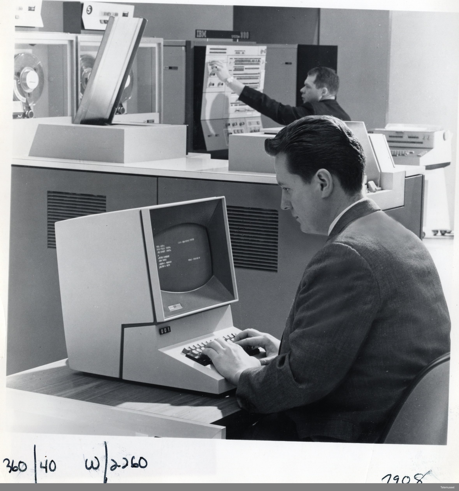

# How to Use R on a Computer

R will install and run straightforwardly on Windows and Macintosh operating systems as well as Linux;[^Linux_Run] however, prior to attempting any install it is important to make a simple distinction first.  R is a programming language, which means it is nothing more than a language you use to communicate instructions to a computer. To communicate those instructions, some type of interface is required.  This is a basic reality that applies to any language.  It is quite difficult to communicate with someone if they have no mouth, eyes, or ears to send and receive communications with. Computers are no different in this respect. Simply understanding the language is not sufficient. For this reason, most operating systems come equipped with a basic way of interfacing with the user via a terminal emulator which is a windowed application that allows you to type instructions (a.k.a. "commands") to your computer. On computers using the Windows operating system, this is referred to as the *Windows Terminal*, on Macintosh and Linux computers this is the *Terminal* application. 

[^Linux_Run]:Admittedly, the process is probably a little less straightforward on Linux, but still managable if you RTFM.

We refer to these as "emulators" because, in a bygone era, "terminals" were peices of computer hardware, consisting mainly of a keyboard paired with a monitor or printer, that people could use to send data to and receive data from a computer. Prior to this, information would have to be entered via punch-card [@Norsk_Digital_Museum].

{width=50% #fig-ibm2260 fig-cap="IBM 2260 terminal used to communicate with an IBM mainframe computer in the 1960s and 1970s." fig-alt="IBM 2260 Terminal and mainframe."}

Relying on your operating system's basic terminal emulator as a primary interface is often a cumbersome and inefficient experience, and definitely not a recommended course of action - though, for what it is worth, Linux users seem to delight in this sort of thing.[^Linux_Me] The preferred means of communicating R to your computer is via the use of what, in programming lingo, is commonly termed an *environment* or, more garrulously, an *integrated development environment* (IDE). This is simply a software application providing the user with a more polished visual workspace and feature set to make programming a smoother experience. IDEs exist for almost every language and for nearly any use case you can imagine. Among R users, [RStudio](https://posit.co/products/open-source/rstudio/) and [Positron](https://positron.posit.co/) are two of the most popular options. That said, IDEs vary widely in style and capability, and using R does not require the use of these IDEs specifically, or any IDE for that matter. Still, installing one alongside the language itself is probably a good idea.

[^Linux_Me]:I say that as someone who worships at the throne of Tux, the Penguin Emperor.

::: callout-caution
## Coming Soon:
- Installation Instructions for R, RStudio, Positron on Windows, Max, and (maybe) beginner friendly Linux Distros.
- Cloud-based IDEs (no installation required)
:::