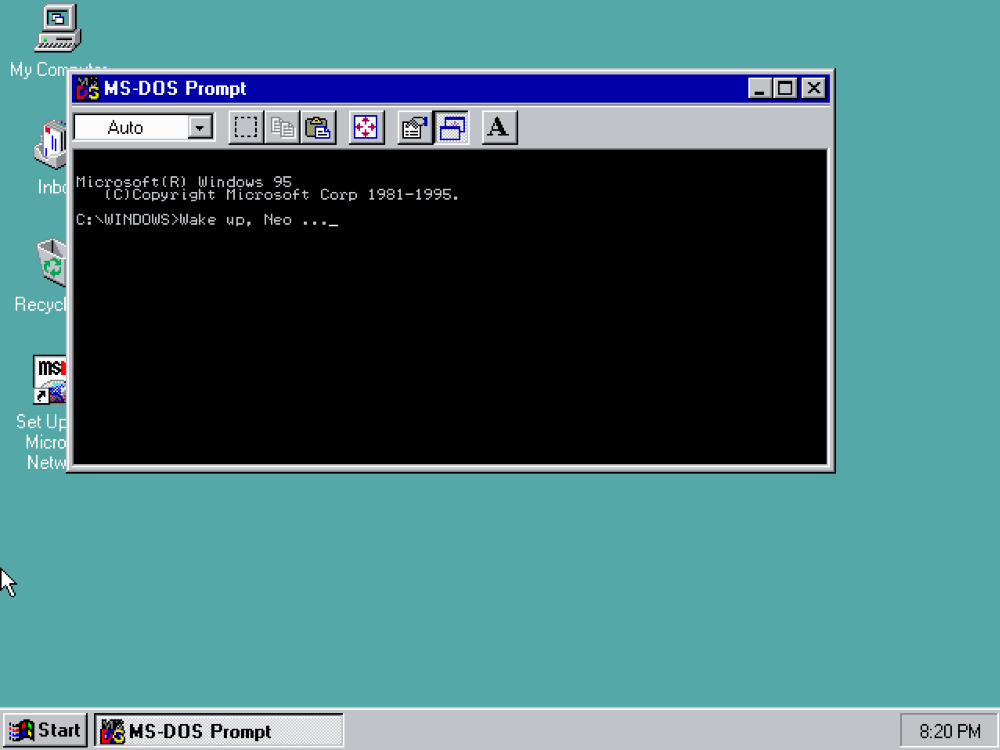
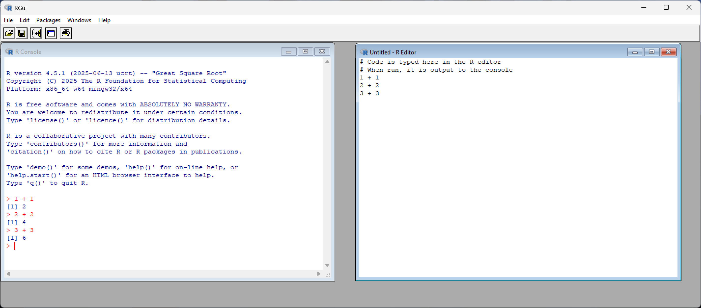
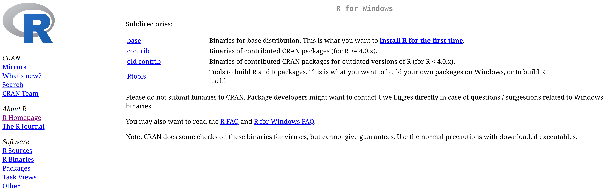
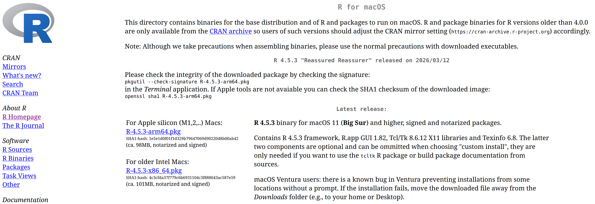

# How to Use R on a Computer

R will install and run straightforwardly on Microsoft (Windows) and Macintosh (MacOS) operating systems as well as Linux;[^Linux_Run] however, prior to attempting any install it is important to make a simple distinction first.  R is a programming language, which means it is nothing more than a language you use to communicate instructions to a computer. To communicate those instructions, some type of interface is required.  This is a basic reality that applies to any language.  It is quite difficult to communicate with someone if they have no mouth, eyes, or ears to send and receive communications with. Computers are no different in this respect. Simply understanding the language is not sufficient. For this reason, most operating systems come equipped with a basic way of interfacing with the user via a "terminal window" (see @fig-win95_MS_DOS). This is an application that allows you to type instructions (a.k.a. "commands") to your computer. Put more simply, when you see people "hacking" in movies, a terminal window is usually what they typing into. On computers using the Windows 11 operating system, this is referred to as the *Windows Terminal*, on Macintosh and Linux computers this is simply the *Terminal* application.[^Modern_NoNo] 

[^Linux_Run]:Admittedly, the process is probably a little less straightforward on Linux, but still managable.

{width=100% #fig-win95_MS_DOS fig-alt="MS-DOS Prompt application in Windows 95"} 

[^Modern_NoNo]:It's worth noting that most popular mobile and desktop operating systems do their absolute best to keep terminal applications out of sight. They they offer too much fine grain control of the computer (a.k.a. freedom). That makes it hard to herd users into the unquestioned patterns of behaviour the platform wants. You'll hear this justified as protecting the "user experience," but it rings hollow: 10-year-olds in the early '90s navigated MS-DOS to launch Duke Nukem, and '80s kids taught themselves BASIC to play Ultima. The assumption that users can't handle a command line isn't about safety, it's about control.

For historical reasons, we refer to these applications "terminals" because they are mimicking specific technology of the past. In a bygone era, "terminals" were peices of computer hardware, consisting mainly of a keyboard paired with a monitor or printer, that people could use to send data to and receive data from a computer. Prior to this, information would have to be entered via punch-card [@Norsk_Digital_Museum].

{width=50% #fig-ibm2260 fig-alt="IBM 2260 Terminal and mainframe."}

Relying on your operating system's terminal application as a primary interface is often a cumbersome and inefficient experience, and definitely not a recommended course of action - though, for what it is worth, Linux users seem to delight in this sort of thing.[^Linux_Me] The preferred means of communicating R to your computer is via the use of what, in programming lingo, is commonly termed an *environment* or, more garrulously, an *integrated development environment* (IDE). This is simply a software application providing the user with a more polished visual workspace and feature set to make programming a smoother experience. IDEs exist for almost every language and for nearly any use case you can imagine. Among R users, [RStudio](https://posit.co/products/open-source/rstudio/) and [Positron](https://positron.posit.co/) are two of the most popular options. That said, IDEs vary widely in style and capability, and using R does not require the use of these IDEs specifically, or any IDE for that matter. Still, installing one alongside the language itself is probably a good idea. However, before doing that, it is important to install the R language itself first.

[^Linux_Me]:I say that as someone who worships at the throne of Tux, the Penguin Emperor.

## Installing the R Programming Language {#sec-R_install}

The standard installation of R will come with an associated environment for the user - provided they are working with either a Microsoft (Windows) or Macintosh (MacOS) operating system. An example of the stock environment R ships with on Windows can be seen in [@fig-RGui]. Admittedly, as IDEs go, this will get the job done, but offers a pretty lackluster experiance. But don't worry, that's what RStudio and Positron are for.

{width=100% #fig-RGui fig-alt="Base R Environment"}

To install R - both the language and environment simultaneously - simply go to the *R Project for Statistical Computing* website: 

<center>
<a href = "https://www.r-project.org/" target = "_blank">https://www.r-project.org/</a>
</center>
<br>

::: callout-caution
R's website makes no apologies for its spartan '90s aesthetic (and we should all be so principled frankly). Additionally, you'll encounter lots of technical jargon throughout the site's various pages and, as a newcomer to R and programming, some (maybe even a lot) of it will feel opaque. That's not a problem and you shouldn't feel bad about it. Skim through it, absorb what clicks, maybe look up one or two things, and let the rest wash over you. Doing this builds familiarity with the landscape and overtime, as your skillset and vocabularly grows, the jargon will become more transparent.
:::

Located on the front-page of this website should be a link labelled CRAN. This stands for "Comprehensive R Archive Network" and is a set of servers around the world that distribute R alongside software packages associated with R. The servers are "mirrored," meaning they all provide the same content.  So there is no need to worry about one server providing incomplete, out-of-date, or unofficial versions of R. Technically speaking, the server closest to your home location is the one you should opt to download from; however, the topmost link labeled "0-Cloud" will be sufficient for most users. The install file is only about 80 megabytes large, so unless you live in the remotest areas of Earth, download speed, and thus choice of server, is probably not a concern.

Once you have chosen a suitable server, you will need select your operating system from the list the site provides (Chromebooks and Mobile devices are out of luck - though cloud-based alternatives do exist that can run R through a web-browser).


### <i class="bi bi-windows"></i> Windows Installation
Click the "Download for Windows" link to access the R download page (see @fig-win_download_1). Select the **"base"** option (labeled "install R for the first time"), which will direct you to the installer for the latest version of R. You will see a download link for the current release—for example, **Download R-4.5.3 for Windows** - which is the newest version available at the time of writing.


{width=100% #fig-win_download_1 fig-alt="Windows download options."}

Once you have downloaded the (`.exe`) installation file (check your *Downloads* folder if you are unsure where on your computer it is located), open it and follow the setup wizard. Keep the default settings unless you have a specific reason to change them as the defaults are sensible for nearly all users. The installer will ask you where to install R (the default is usually `C:\Program Files\R\R-4.5.3`), whether to create shortcuts, and a few other minor options. You can safely click through these. Once installation is complete, you can launch R from the Start menu or a desktop shortcut (if you chose to create one during setup). You should see the basic R GUI (graphical user interface) window open (see @fig-RGui), confirming that R is installed and working.

::: callout-tip
## Administrator privileges

If you are installing R on a university or work computer, you may need administrator privileges. If you run into permission errors during installation, contact your IT department for assistance.
:::

### <i class="bi bi-apple"></i> MacOS Installation {#sec-mac_install}
Click the "*Download R for macOS*" link to access the R download page and select the option relevant to your computer (see @fig-mac_download). At the time of writing this, Macintosh computers have recently begun being manufactured using their own in-house built processors (i.e., dubbed "Apple silicon"); however, many older Macintosh computers (pre-2023) still contain Intel-made processors.

{width=100% #fig-mac_download fig-alt="macOS download options."}

To determine your processor type, click the Apple logo in the top-left corner of your desktop screen and select "*About This Mac*". Machines using Apple silicon will display a row labeled "*Chip*" and state something like "Apple M1," "Apple M2," or "Apple M3." If you see this, choose the install file that says "**arm64**" (this is the architecture used by Apple silicon).

Machines using Intel processors will display a row labeled "*Processor*" followed by the make and model of the processor (e.g., "2.3 GHz Dual-Core Intel Core i5"). In this case, choose the install file that says "**x86_64**" (this is the architecture used by Intel chips).

Once you have downloaded the (`.pkg`) installation file (check your *Downloads* folder if you're unsure where it's located), open it and follow the setup wizard. Keep the default settings unless you have a specific reason to change them. The installer will guide you through a series of screens mostly just clicking "Continue" and entering your password to authorize the installation.

Once installation is complete, you can delete the install file to free up disk space, and launch the base R environment from the Launchpad or Applications folder.

::: callout-tip
## macOS security settings

Depending on your macOS version and security settings, you may see a warning that the file "cannot be opened because it is from an unidentified developer." If this happens, click the Apple logo in the top-left corner of your desktop screen, select *System Settings*, then click *Privacy & Security* in the sidebar.

Scroll to the *Security* section and press the *Open Anyway* button. Then choose *Open*. Finally, enter your login password and click *OK*.
:::


### <i class="bi bi-tux"></i> Linux Installation
Experianced users of Linux are not likely to need any instructions on how to install R on to their system; however, inexperianced users may need a helping hand as the install process is done entirely via the terminal. There are no install files you can download from a website and launch with a couple clicks of the mouse. <!-- This may seem like a drawback, but it's actually a strength. -->

<!-- ::: {.callout-tip icon = false collapse = true}
## <i class="bi bi-terminal"></i> The Terminal is Your Friend, Not Your Enemy
If you are new to Linux, the frequent mentions of the terminal might seem like a step backward. For decades Windows and macOS has been trying to hide their terminals from everyday users. But this apparent inconvenience is actually one of Linux's greatest strengths.

- Once you learn basic commands, terminal operations are often faster than clicking through multiple menus. Installing a package becomes a single line instead of opening a software center, searching, scrolling, and clicking through dialogs.

- Windows and macOS prioritize making their systems appear simple by hiding complexity. This is helpful, until something goes wrong. The terminal shows you exactly what's happening and gives you fine-grained control over every option. Error messages, while cryptic at first, tell you precisely what failed.

- Modern operating systems increasingly treat users as consumers rather than owners of their machines. Updates install automatically, telemetry data is collected by default, and background processes run without explanation. The terminal gives you direct control: you decide what runs, when it runs, and what permissions it has. You can inspect network traffic, review system logs, and block unwanted behaviour. Windows and macOS can (and do) send and sell usage data, diagnostic information, and behavioural telemetry to their corporate owners, and their GUI-focused design makes it difficult for average users to know this is happening and, more importantly, stop it.

- Terminal commands can be copied, pasted, shared, and scripted. When someone helps you solve a problem, they give you exact commands that work identically on your system. Compare this to GUI instructions across different Windows versions or macOS releases: "Open System Preferences (or is it System Settings now?) then click the icon that looks like a gear, or maybe a switch, depending on your version..."

- Virtually all technical documentation, Stack Overflow answers, and professional guides provide terminal commands because they're unambiguous. They work the same whether you're using GNOME, KDE, or any other desktop environment. Windows and macOS fragment their user base across constantly changing GUI designs, but Linux terminal commands written twenty years ago often still work today.

- Here's the truth: professionals use terminals extensively on all operating systems. Windows added PowerShell because developers demanded terminal access. macOS ships with a Unix terminal that advanced users rely on constantly. The difference is that Linux doesn't pretend these tools don't exist or shouldn't be learned. By making the terminal a first-class citizen, Linux is teaching you skills that are essential for computer literacy, scientific computing, and so much more.

- The argument goes that Windows and macOS limit what you can do through their GUIs to protect users from themselves and that this is a reasonable trade-off for the lack of freedom and control general consumers receive. Linux disagrees and trusts you with full system access. Need to batch-rename 10,000 files based on a pattern? Need to automate a complex workflow? These tasks range from tedious to impossible in GUI-only environments but are straightforward with terminal commands.

- Don't worry, it gets easier quickly. You don't need to memorize hundreds of commands. In practice, you'll use the same dozen repeatedly: `ls`, `cd`, `mkdir`, `sudo apt install`. Within a few weeks, these become second nature, and you'll find yourself opening a terminal by choice even when GUI alternatives exist, they're often just faster and more direct and more advanced knowledge will come with time. You just need to be perpretually curious and ask what some line of code is doing.

The terminal isn't a historical artifact Linux hasn't bothered to replace. It's a powerful, efficient interface that other operating systems have tried to paper over with layers of graphical abstraction. By learning to work with the terminal, you're not stepping backward in time, you're gaining direct access to how computers actually operate, a skill that will serve you throughout your career in statistics, research, and beyond.
::: -->

When it comes to Linux distributions (a.k.a. Linux operating systems), there are of course too many to even name. This makes it unrealisic to cover the install process for all of them. Consequently, this section will focus on [Debian](https://www.debian.org/), [Ubuntu](https://ubuntu.com/desktop), and Ubuntu's derivatives such as [Linux Mint](https://www.linuxmint.com/), [Kubuntu](https://kubuntu.org/), [Budgie](https://ubuntubudgie.org/), and others.

::: callout-important
## No graphical environment included
Unlike Windows and MacOS, installing R on Linux does not include a graphical coding environment (see @fig-RGui). Consequently, Linux users must use the terminal to run R until they install an IDE such as RStudio or Positron.
:::

If you are using Debian or Linux Mint and are relatively new to Linux, I recommend first reading the installation instructions for Ubuntu below. This will familiarize you with how R installation works on Linux systems generally.

::: {.callout-note collapse="true"}
## Ubuntu

Many Linux distros, like Ubuntu, have their own officially currated repositories that you can download R from. However, the version of R these store often lags quite a bit behind the offical files supplied by the R Project's CRAN repository. The reason being, Ubuntu's package maintainers need time to test software, ensure it integrates well with other software on Ubuntu, and verify it works across different Ubuntu versions. This deliberate process keeps things stable but, unfortunately, means you're not getting the latest version of R immediately.

By contrast, if you need the latest R version or specific recent features/bug fixes, you can add the R Project's own repository to Ubuntu's package manager configuration `apt` (Advanced Package Tool).

#### Installing from Ubuntu's Repository (Simpler, but Older Version)

If using Ubuntu's offical repository appeals to you, inside your terminal you can just run ...

```bash
sudo apt update
sudo apt install r-base
```

The first command refreshes your system's list of available packages. The second installs R.  You can now skip to **step 7** below.

#### Installing from the R Project's Repository (Recommended for Latest Version)

If, on the other hand, you would like the most recent releases of R and R packages (this is the reccommended approach), you will first need to configure your system to trust and use the CRAN repository.

**Step 1: Refresh your package lists**

In your terminal, run:

```bash
sudo apt update
```

This tells `apt` "go fetch the latest list of available packages and their versions" from all the configured repositories on your computer.

**Step 2: Install helper tools**

Next we are going to install two helper programs, `software-properties-common` and `dirmngr`. The former provides tools for managing software repositories. The latter is background service that manages keys and certificates. It's used to verify GPG signatures on packages and keys. 

```bash
sudo apt install --no-install-recommends software-properties-common dirmngr
```

The `--no-install-recommends` flag tells `apt` to install only the essential packages and skip optional extras, keeping your system lean.

**Step 3: Download and install the GPG public key**

Now we need to download the GPG public key from the R Project's official server. This key is used to verify that R packages from the CRAN Ubuntu repository are legitimate and have not been tampered with. Think of it as a digital signature that proves authenticity.

```bash
 wget -qO- https://cloud.r-project.org/bin/linux/ubuntu/marutter_pubkey.asc | sudo tee -a /etc/apt/trusted.gpg.d/cran_ubuntu_key.asc
```

Breaking this down: `wget -qO-` quietly downloads the key file and outputs it to your terminal. The pipe (`|`) sends that output to `sudo tee`, which writes it to the system's trusted key directory.

**Step 4: Add the CRAN repository to your system**

Next we add the R Project's repository to your system's package sources so `apt` knows where to find R packages. To do this, you need to determine the codename of Ubuntu you are running. Ubuntu names each new long term support (LTS) release of its operating system with a codename:

- focal = 20.04
- jammy = 22.04
- noble = 24.04

To determine the code name just run `lsb_release -cs` in the terminal. This will print your Ubuntu version's codename. Now, in the code below, replace `noble` with the codename of your version of Ubuntu:

```bash
echo "deb https://cloud.r-project.org/bin/linux/ubuntu noble-cran40/" \
 | sudo tee /etc/apt/sources.list.d/cran-r.list
```

This command adds a new repository configuration file to your system, telling `apt` to check CRAN's servers for R packages.

**Step 5: Install R**

Now we can finally install R:

```bash
sudo apt update
sudo apt install r-base
```

**Step 6: Install development tools (important!)**

For good measure, install build tools for compiling and installing R packages from source. This is needed for many CRAN package installations, especially those that include compiled code (which is common):

```bash
sudo apt install r-base-dev
```

Skipping this step may cause headaches later when you try to install certain packages and get cryptic error messages about missing compilers or libraries.

**Step 7: Verify your installation**

Check the version of R you have installed:

```bash
R --version
```

You should see output indicating the R version number, confirming that R is installed and accessible.

**Step 8: Launch R**

To run R simply type:

```bash
R
```

You should see the R "console" appear in your terminal. You can now type R commands interactively. To quit R and return to your normal terminal prompt, type:

```bash
q()
```

R will ask if you want to save your workspace. For now, you can type `n` (no) and press *Enter*.

:::

::: {.callout-note collapse="true"}
## Linux Mint and other Ubuntu-based Distributions

The installation process on other Ubuntu-based distributions—such as Linux Mint, Edubuntu, Kubuntu, Lubuntu, Ubuntu Budgie, Ubuntu Cinnamon, Ubuntu MATE, Pop!_OS, and others—is identical to regular Ubuntu with one important exception.

Some distributions, such as Linux Mint, have their own distinct codenames that differ from Ubuntu's. For example, Linux Mint 21 "Vanessa" is based on Ubuntu 22.04 "Jammy," but uses "Vanessa" as its own codename. This means that in the steps above where we replace `noble`, we need to make sure we use the Ubuntu codename that your distribution is built from, not the distribution's own codename.

To find the underlying Ubuntu codename, run the following in the terminal:

```bash
. /etc/os-release
echo "$UBUNTU_CODENAME"
```

This will print the Ubuntu codename (e.g., jammy for distributions based on Ubuntu 22.04). Use this codename when adding the CRAN repository in **Step 4** of the Ubuntu instructions above.

Everything else about the installation should be the same as standard Ubuntu.
:::

::: {.callout-note collapse="true"}
## Debian

Debian is the upstream distribution that Ubuntu is based on, so the process is similar but with some important differences. Follow the steps below using the terminal.

**Step 1: Add the CRAN repository**

Add the CRAN repository to Debian's list of approved sources to ensure you can install the latest version of R.

```bash
sudo nano /etc/apt/sources.list
```

This command opens **nano**, a text editor that runs inside the Linux terminal. Use the arrow keys to navigate to the bottom of the document and add the following line:

```bash
deb https://cloud.r-project.org/bin/linux/debian trixie-cran40/
```

**Important:** Replace `trixie` (the codename for Debian 13) with the codename for your Debian version:

- Debian 13: `trixie`
- Debian 12: `bookworm`
- Debian 11: `bullseye`

You can check your Debian version by running `lsb_release -cs` in a seperate terminal window.

Once added, save the file by pressing Ctrl + O, then press Enter to confirm. Exit nano by pressing Ctrl + X.

**Step 2: Add the CRAN security key**

Import and register the CRAN GPG key to verify package authenticity. First, install `gnupg` if it's not already installed:

```bash
sudo apt install gnupg
```

Then, download and add the CRAN public key:

```bash
gpg --keyserver keyserver.ubuntu.com --recv-key '95C0FAF38DB3CCAD0C080A7BDC78B2DDEABC47B7'
gpg --armor --export '95C0FAF38DB3CCAD0C080A7BDC78B2DDEABC47B7' | sudo tee /etc/apt/trusted.gpg.d/cran_debian_key.asc
```

Finally, update your package lists:

```bash
sudo apt update
```

**Step 3: Install R**

Update the package list (again, to be safe) and install R along with development tools:

```bash
sudo apt update
sudo apt install r-base r-base-dev
```

Including `r-base-dev` ensures you have the compilers and libraries needed to build R packages from source.

**Step 4: Verify your installation**

Check the version of R you have installed:

```bash
R --version
```

You should see output confirming the R version, indicating that R is installed correctly.

**Step 5: Launch R**

To run R, type:

```bash
R
```

To quit R and return to the terminal, type:

```bash
q()
```

R will ask if you want to save your workspace. For now, you can type `n` (no) and press *Enter*.

:::

::: {.callout-note collapse="true"}
## Other Linux Distributions

The official R Project website contains detailed installation instructions for other major Linux distributions, including Fedora, Red Hat, openSUSE, Arch Linux, and more. Visit: [https://cloud.r-project.org/bin/linux/](https://cloud.r-project.org/bin/linux/) 

If you are using a distribution not explicitly covered, check the site for guidance or consult your distribution's documentation. In many cases, R is available through your distribution's package manager. Just be aware that, as with Ubuntu's default repositories, the version may lag behind the latest CRAN release.
:::

## Installing an IDE (RStudio and Positron)

As mentioned earlier, the default R environment that ships with a Windows and MacOS install of R is quite limited (see @fig-RGui). While perfectly functional, it lacks many quality-of-life features found in modern IDEs. [RStudio](https://posit.co/products/open-source/rstudio/) and [Positron](https://positron.posit.co/), by contrast, are the two most feature-rich IDEs for R, with RStudio having dominated the community for years and Positron emerging as a compelling newer alternative.

As of writing this, RStudio is the established choice. It has extensive documentation, countless tutorials, and broad support across the R community. By contrast, Positron is a much more recent development offering a more flexible and responsive interface built on Visual Studio Code's foundation.[^VS_code] Both applications are developed by Posit, a company focused on open-source tools for data science and scientific research. For a detailed feature comparison, see Posit's [comparison page](https://positron.posit.co/migrate-rstudio-compare.html).

[^VS_code]:Visual Studio Code is a free open-source IDE that has become the standard choice for many developers across multiple programming languages.

If you can't decide which to choose and want definitive choice made for you, go with Positron. It integrates modern development practices more seamlessly than RStudio, which was designed in 2011 when the computing landscape looked rather different. Both are excellent, but Positron will not make you feel like you are using legacy software.

Installing an IDE is not strictly necessary to work through this book's content; however, the wealth of features and customization they offer makes it a worthwhile endeavor and is strongly recommended for anyone reading this text. 

### Installing RStudio

To install RStudio simply visit:

<center>
<a href = "https://posit.co/download/rstudio-desktop/" target = "_blank">https://posit.co/download/rstudio-desktop/</a>
</center>
<br>

Installing R studio is as simple as selecting the installation file relevant to your operating system ("OS" on the website's table), downloading it, and launching it with a double-click of the mouse. The setup wizard will guide you through the process. Keep the default settings unless you have a specific reason to change them.

::: {.callout-note icon = false collapse = true}
## <i class="bi bi-windows"></i> Windows Installation Notes

Download the `.exe` file for Windows, double-click it, and follow the setup wizard. The installer will automatically detect where R is installed on your system. If for some reason it cannot find R, make sure you have installed R first (see the previous sections).

Once installation is complete, you can launch RStudio from the Start menu or a desktop shortcut.
:::

::: {.callout-note icon = false collapse = true}
## <i class="bi bi-apple"></i> MacOS Installation Notes

Download the `.dmg` file for macOS and double-click it to open. For macOS users, there will probably be no installation wizard; rather, you will likely be prompted to drag the RStudio icon into your Applications folder. Once that is done, RStudio is installed. You can then eject the disk image and delete the `.dmg` file to free up space.

To launch RStudio, open your Applications folder or use Spotlight (press Cmd + Space and type "RStudio"). The first time you launch RStudio, macOS may ask you to confirm that you want to open an application downloaded from the internet. Click "*Open*" to proceed.
:::

::: {.callout-note icon = false collapse = true}
## <i class="bi bi-tux"></i> Linux Installation Notes

Users of Debian, Ubuntu, Linux Mint, and other Ubuntu-based distributions (e.g., Kubuntu, Edubuntu, Ubuntu Budgie, Pop!_OS, etc.) will need to select the install file that corresponds to the major version of Debian or Ubuntu they are running. In most cases, this will be Debian 13 or Ubuntu 24 (or Ubuntu 22 if your system is slightly older). If you are unsure which version you are running, type `lsb_release -a` in the terminal to check.

The install file is a `.deb` file. Once downloaded to your computer, these can usually be run without issue using a simple double-click of the mouse (similar to the `.exe` files present on Windows systems). Your system's software installer will open, and you can click "*Install*." However, the more reliable method is to use the terminal to install the file, as it handles dependencies more gracefully. Should you want to take this approach, follow the three steps below.

**Step 1: Open a terminal**

Press `Ctrl + Alt + T` or search for "Terminal" in your application menu.

**Step 2: Navigate to your Downloads folder**

Assuming the file you downloaded is in your "Downloads" folder, navigate there in your terminal by typing:

```bash
cd ~/Downloads
```

The `~` symbol represents your home directory, so this takes you to `/home/yourusername/Downloads`.  

**Step 3: Install the file**

Install the file by typing the code below, making sure to replace `filename.deb` with the actual name of the file you downloaded (you can type the first few letters and press Tab to autocomplete the filename):

```bash
sudo apt install ./filename.deb
```
The `./` before the filename tells apt to look in the current directory. You will be prompted to enter your password. The installer will automatically fetch any missing dependencies and complete the installation.

**Step 4: Launch RStudio**

Once installed, you can launch RStudio from your application menu or by typing `rstudio` in the terminal.
:::

### Installing Positron
The installation process for Positron is relatively seamless across all platforms. In the case of Windows, macOS, and Linux, the process is as simple as downloading the appropriate install file and double-clicking it with your mouse.[^mouse_linux]

[^mouse_linux]:While Linux users generally can double-click the `.deb` install file and have it run without issue, the reccommended course of action is to install the `.deb` file through the terminal like was described in the RStudio install instructions.

To install Positron visit: 

<center>
<a href = "https://positron.posit.co/download.html" target = "_blank">https://positron.posit.co/download.html</a>
</center>

::: {.callout-note icon = false collapse = true}
## <i class="bi bi-windows"></i> Windows Installation Notes
The Windows install file for Positron comes in two forms: a "system level" install and a "user level" install. 

- **User-level install:** Installs Positron only for your user account. No administrator privileges required. This is the best choice if you are the primary (or only) user of the machine, or if you don't have admin rights.
- **System-level install:** Installs Positron for all users on the machine. Requires administrator privileges.

For most users, user-level is the recommended choice. Simply download the relevant install file (it will be a `.exe` file) and double-click it to launch the setup wizard. Follow the prompts and keep the default settings unless you have a specific reason to change them.

Once installation is complete, you can launch Positron from the Start menu or a desktop shortcut. When Positron opens, you should see a sleek, modern interface with a sidebar on the left, a main editor pane in the center, and panels for the console, variables, and plots on the right or bottom.
:::

::: {.callout-note icon = false collapse = true}
## <i class="bi bi-apple"></i> MacOS Installation Notes

Just as with the R language installation, the install file you choose depends on whether your device has an Apple Silicon processor or an Intel processor. Details on determining your processor type can be found in @sec-mac_install.

Download the appropriate `.dmg` file:

- Apple Silicon (M1, M2, M3, etc.): Choose the file labeled for Apple Silicon or ARM64.
- Intel processors: Choose the file labeled for Intel or x86_64.

Once downloaded, double-click the `.dmg` file to open it. You will be prompted to drag the Positron icon into your Applications folder. Once that's done, Positron is installed. You can then eject the disk image and delete the `.dmg` file to free up space.

To launch Positron, open your Applications folder or use Spotlight (press Cmd + Space and type "Positron"). The first time you launch Positron, macOS may ask you to confirm that you want to open an application downloaded from the internet. Click "Open" to proceed.
:::

::: {.callout-note icon = false collapse = true}
## <i class="bi bi-tux"></i> Linux Installation Notes

For Debian, Ubuntu, Linux Mint, and other Debian/Ubuntu-based distributions, download the `.deb` file. Once downloaded, you can double-click it to install using your system's software installer, or use the terminal method described below for a more reliable installation.

If you prefer the terminal method (recommended), follow these steps:

**Step 1: Navigate to your Downloads folder**

```bash
cd ~/Downloads
```

**Step 2: Install Positron**

Replace `positron-xxxx.deb` with the actual filename:

```bash
sudo apt install ./positron-xxxx.deb
```

**Step 3: Launch Positron**

Once installed, you can launch Positron from your application menu or by typing positron in the terminal.

For other Linux distributions (Fedora, Arch, etc.), check the <a href = "https://positron.posit.co/download.html" target = "_blank">Positron download page</a> for options specific to your system.
:::

## Cloud-Based Alternatives

If you are using a Chromebook, tablet, mobile device, or you simply do not want to install software on your computer, you can run R through a cloud-based platform. These platforms run R on remote servers and let you access it through a web browser.

Popular options include:

- <a href = "https://posit.cloud/" target = "_blank">Posit Cloud</a> (formerly RStudio Cloud): A browser-based version of RStudio. Free tier available, with paid plans for more storage and computing power.

- <a href = "https://colab.research.google.com/" target = "_blank">Google Colab</a>: Primarily designed for Python, but can easily set to run R.

- <a href = "https://cocalc.com/" target = "_blank">CoCalc</a>: A collaborative platform that supports R, Python, and other languages.

Cloud-based platforms are convenient and require no installation, but they require an internet connection, and may have limitations in terms of functionality, computing power, storage, and session length. For serious work, a local installation is generally preferable, but cloud platforms are excellent for getting started or for situations where you cannot install software or need real-time collaboration with people.

## Upgrading R

R receives updates two to three times a year, and it is generally good practice to upgrade regularly. These updates include bug fixes, performance improvements, security patches, and occasionally new features or enhancements to existing functions. While you do not need to update immediately every time a new version is released, staying reasonably current (within a year or so of the latest release) helps ensure compatibility with modern packages and avoids running into bugs that have already been fixed.

### Upgrading on Windows <i class="bi bi-windows"></i> and MacOS <i class="bi bi-apple"></i>

There are various methods you can use to update R, but assuming you are on Windows or macOS, the most straightforward method is to simply download the latest version of R as though you were installing it for the first time (following the same steps outlined earlier in this chapter) and then reinstall your commonly used packages.[^packages]

[^packages]:"Packages" (also commonly referred to as "libraries") will be explained later.

If you follow the default setup during installation, you do not need to uninstall the previous version of R. In fact, it is usually preferable not to, as both RStudio and Positron allow you to easily switch between different versions of R installed on your computer. This can be useful if you need to reproduce old analyses or if a particular package has not yet been updated to work with the newest R version.

### Upgrading on Linux <i class="bi bi-tux"></i>
For Linux users, updating R depends on how you originally installed it. If you installed R from the CRAN repository (as recommended in the Linux installation instructions earlier), updating R is as simple as running the following commands in the terminal:

```bash
sudo apt update
sudo apt upgrade
```

The first command refreshes your system's list of available packages and their versions. The second command upgrades all installed packages, including R, to their latest versions. If a new version of R is available in the CRAN repository you configured earlier, this will install it automatically.

If you installed R from your distribution's default repositories (which tend to lag behind CRAN), the same commands will work, but you may not get the absolute latest version. In that case, you may want to switch to the CRAN repository following the instructions in the Linux installation section above.

### R Version Nicknames

At the time of writing, R is on version 4.5.3, nicknamed the "Reassured Reassurer" version. New releases of R are given nicknames that, inexplicably, are all obscure references to Peanuts (a.k.a. Charlie Brown and Snoopy) comic strips. Past versions have included gems like "Great Pumpkin," "Planting of a Tree," and "Innocent and Trusting." No one quite knows why this tradition exists, but it has become a charming quirk of the R software. If you ever need a conversation starter at a data science meetup, asking someone to explain the latest R version nickname is a solid bet.

::: {.callout-note collapse="true"}
## Version Numbering

R's version numbering system, follows what is known as **semantic versioning**. This means version numbers are structured as Major.Minor.Patch (e.g., 4.5.3)

- **Major version (the first number, e.g., the 4 in 4.5.3):** Major version changes are relatively rare and signal significant, potentially breaking changes. In other words, code that worked in the previous major version might not work anymore, or might behave differently.

- **Minor version (the second number, e.g., the 5 in 4.5.3):** This is incremented when new features are added in a backward-compatible manner. Existing code should continue to work, but new functionality is now available. Minor version updates happen more frequently than major ones.

- **Patch version (the third number, e.g., the 3 in 4.5.3):** This is incremented for small updates that fix errors or issues without adding new features or breaking existing code. Patch updates are the most frequent type of update.

So in the current version 4.5.3, the 4 indicates we are in the fourth major version of R, the 5 means there have been five minor feature releases since version 4.0, and the 3 indicates this is the third patch/bug fix release for version 4.5.

It is worth noting that R's major version number has remained at 4 for several years now (since version 4.0.0 was released in April 2020). Most updates to R are minor or patch releases, which is typical for mature software.
:::

### What Happens to Your Packages When You Upgrade?

When you upgrade R, your existing packages (add-ons that extend R's functionality, which we will cover in detail later) generally do not automatically carry over to the new version. This is because packages are stored in version-specific directories on your computer. For example, packages installed under R 4.4.x will live in a different folder than those installed under R 4.5.x.

This means that after upgrading R, you may need to reinstall your packages. Don't panic, this is a normal part of the process. There are a few ways to handle this but the simplest method for beginners is to simply reinstall packages manually.

As you start using R after the upgrade, you will likely encounter errors like:

```r
Error in library(ggplot2) : there is no package called 'ggplot2'
```

When this happens, reinstall the missing package like so:

```r
install.packages("ggplot2")
```


